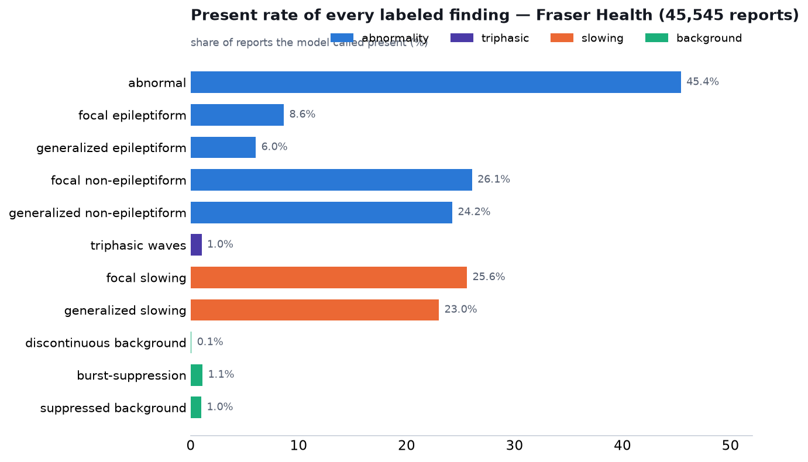

# EEG report labeling with MedGemma — the full picture

This repository labels free-text clinical EEG reports with a locally-run **MedGemma-27B**, and
compares the labels against the Harvard EEG Database where a matching field exists. This page is
the overview: which findings we labeled, on which reports, and how often each turns up. The
head-to-head comparisons against Harvard's own labels live in the per-topic reports linked below,
and every run is reproducible from **[REPRODUCE.md](REPRODUCE.md)**.

## How the labeling works

Every finding is read straight from the text of the EEG report. The model records what the
neurologist wrote — it does not diagnose the patient, so it should not infer a finding from a
diagnosis, from the clinical context, or from a related pattern. We use MedGemma-27B (a 27B medical
model) run locally on the cluster at temperature 0, with a grammar that constrains the output, so
every report comes back in a valid, parseable form. Most findings are a three-way call — the report
says it is there (`present`), says it is not (`explicitly_absent`), or does not bring it up
(`not_mentioned`); the abnormality group uses a 1–4 confidence scale where 3–4 counts as present.

Two datasets:

- **Fraser Health (FHA)** — 45,545 reports, the local corpus.
- **Harvard (HEEDB)** — three hospitals with report text: MGH (55,557), BWH (21,035), BCH (25,022).
  BIDMC is excluded because its report text is not in the shared data.

## What we labeled — eleven findings in four groups

| group | findings | scoring | reports |
|---|---|---|---|
| **Abnormality** | overall abnormal/normal; focal & generalized *epileptiform*; focal & generalized *non-epileptiform* | joint, 1–4 (present = 3–4) | [vs Mistral](reports/medgemma_vs_mistral.md) · [vs Bio-Medical-Llama](reports/medgemma_vs_biomedllama.md) · [on Harvard](reports/medgemma_vs_biomedllama_abnormality.md) |
| **Triphasic waves** | triphasic waves (+ phenotype) | three-way | [FHA](reports/triphasic_waves.md) · [Harvard](reports/triphasic_harvard.md) |
| **Slowing** | focal slowing; generalized slowing | three-way | [report](reports/slowing_vs_harvard.md) |
| **Background** | discontinuous; burst-suppression; suppressed | three-way | [combined](reports/background_patterns.md) · [discontinuous](reports/discontinuous_background.md) · [burst-suppression](reports/burst_suppression.md) · [suppressed](reports/suppressed_background.md) |

The abnormality group came first and its two *non-epileptiform* buckets are deliberately broad —
they lump slowing together with attenuation, asymmetry, disorganization and excessive beta. The
later slowing group carves out slowing on its own, which is why "focal non-epileptiform" (26%) and
the dedicated "focal slowing" (26%) look similar but are not the same field.

## How often each finding appears — Fraser Health



| finding | present (FHA) |
|---|---|
| abnormal | 45.4% |
| focal epileptiform | 8.6% |
| generalized epileptiform | 6.0% |
| focal non-epileptiform | 26.1% |
| generalized non-epileptiform | 24.2% |
| triphasic waves | 1.0% |
| focal slowing | 25.6% |
| generalized slowing | 23.0% |
| discontinuous background | 0.1% |
| burst-suppression | 1.1% |
| suppressed background | 1.0% |

The shape is what routine EEG looks like: about half the studies are abnormal; slowing is the most
common specific abnormality; epileptiform findings are less frequent; and the critical-care
background patterns — triphasic, discontinuous, burst-suppression, suppressed — are all rare, around
1% or below. Discontinuous is the rarest because Fraser Health reports almost never comment on
continuity at all.

## How often each finding appears — Harvard (our labels)

| finding | MGH | BWH | BCH |
|---|---|---|---|
| abnormal | 67% | 78% | 57% |
| triphasic waves | 4.4% | 11.2% | 0.5% |
| focal slowing | 34.5% | 50.6% | 17.7% |
| generalized slowing | 60.6% | 50.5% | 30.6% |
| discontinuous background | 2.6% | 3.4% | 7.5% |
| burst-suppression | 3.5% | 3.0% | 1.3% |
| suppressed background | 1.4% | 2.9% | 0.9% |

The Harvard reports come from large academic centers with heavy critical-care and monitoring
caseloads, so the abnormal rate and the background patterns run higher than at Fraser Health, and
they vary by hospital. BCH is a children's hospital, which is why triphasic waves (a metabolic/anoxic
marker) are almost absent there (0.5%), while discontinuous background — a normal feature of the
immature/neonatal EEG — is the most common of the three there (7.5%). These are population
differences, not the model behaving differently — the same annotation runs on both datasets.

## How much to trust the labels

There is no human-labeled ground truth for the full sets, but there are independent checks:

- **Abnormality** was validated against a human annotator on ~2,500 reports: F1 of 96 on the overall
  abnormal call, mid-to-high 80s on the harder findings, and the model's own confidence sorts the
  labels well (confident calls ~99% correct, borderline ~80%). See
  [reports/medgemma_vs_mistral.md](reports/medgemma_vs_mistral.md).
- **Triphasic** was run twice with different prompt wordings and agrees with itself on 99.9% of
  reports (κ = 0.99) on both datasets; a text-guard removes the one recurring error (reading
  triphasic waves into an anoxic picture with no triphasic wording in the text).
- **Slowing and background** are grammar-constrained three-way calls; every report returned a valid
  label, and the split is reported as-is.

So the percentages above are the model's reading of the reports, backed by validation on abnormality
and by prompt-stability and text checks on the rest — not a clinically verified rate.

## Reports

- **Abnormality** — [medgemma_vs_mistral.md](reports/medgemma_vs_mistral.md) (vs Mistral + accuracy
  vs human on FHA), [medgemma_vs_biomedllama_abnormality.md](reports/medgemma_vs_biomedllama_abnormality.md)
  (vs Harvard's own model).
- **Triphasic** — [triphasic_waves.md](reports/triphasic_waves.md) (FHA),
  [triphasic_harvard.md](reports/triphasic_harvard.md) (Harvard).
- **Slowing** — [slowing_vs_harvard.md](reports/slowing_vs_harvard.md).
- **Background** — [background_patterns.md](reports/background_patterns.md) and the three per-field
  notes: [discontinuous](reports/discontinuous_background.md),
  [burst_suppression](reports/burst_suppression.md), [suppressed](reports/suppressed_background.md).
- **Consolidated Harvard comparison** — [eeg_labeling_summary.md](reports/eeg_labeling_summary.md).
- **How Harvard's own labels are coded** — [harvard_llm_labeling.md](reports/harvard_llm_labeling.md).
- **Reproducing everything** — [REPRODUCE.md](REPRODUCE.md).

## Reproduce this overview figure

```bash
python -m analysis.overview_prevalence   # reports/figures/overview_fha_prevalence.png
```
