# All prompts — the full comparison

Every prompt we tried for MedGemma-27B, and how it did. All numbers are **pooled over
1994 reports** (Zoe n=1495 + Maria n=499), **Core F1** and whole-report accuracy vs the
reference annotator **LD**, with the second annotator **SG** held out. Baselines: the
paper's **Mistral-7B** (Tian et al.) and the **human** second annotator (SG vs LD).

## The prompts

| Prompt | One line | What it changes |
|---|---|---|
| **v1** | Baseline | Impression-first, short definitions — the starting point |
| **v2** | Professor's revision | Neurologist role, read the report *body* first, extended ACNS/ILAE definitions |
| **v3** | Focal-epi exclusions | v1 + an explicit list of what does **not** count as focal epileptiform (raises precision) |
| **v4** | Procedure | v1 + a step-by-step detect → localize → assign routine |
| **v5** | Slowing discriminator | v3 + a focal-vs-generalized rule for **non-epileptiform slowing** |
| **v6** | Ask for consistency | v3 + a prompt instruction to self-check the overall/subtype agreement |
| **v7** | Body-aware abnormality | v5 + "call it abnormal if the body describes an abnormality the Impression downplays" |
| **v8** | Simplified | A deliberately short prompt (~340 tokens) — only the two decision boundaries |
| **v9** | Reasoning-first | Concise expert frame + a free-text `reasoning` field, letting the model deliberate |
| **v10** | Evidence calibration | v5 + "tie confidence to how explicitly the report supports each subtype" |

A **`…g`** suffix (e.g. **v5g**) means the variant is run with **grammar-enforced
consistency** (`ENFORCE_CONSISTENCY=1`): a GBNF grammar emits `overall_abnormal` last and
only lets it be abnormal when a subtype is, so a self-contradictory answer is impossible
to produce. Full prompt texts are in [`../prompts/`](../prompts/).

## Where every prompt lands

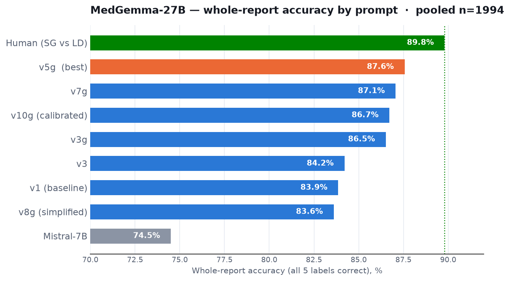

**What you see:** whole-report accuracy (all five labels correct) for each configuration,
from Mistral-7B up to the human agreement line (89.8%, dotted). Our baseline **v1 already
clears Mistral by ~10 points.** Adding grammar-enforced consistency is the big step
(**v3g/v5g**), and **v5g (87.6%)** is the best — within ~2 points of the human ceiling.
The rejected ideas cluster below it: **v8 (simplified)** even falls *below* the v1
baseline, because dropping the detailed rules brings the over-calling straight back.

## Our top prompts vs Mistral and human, per category

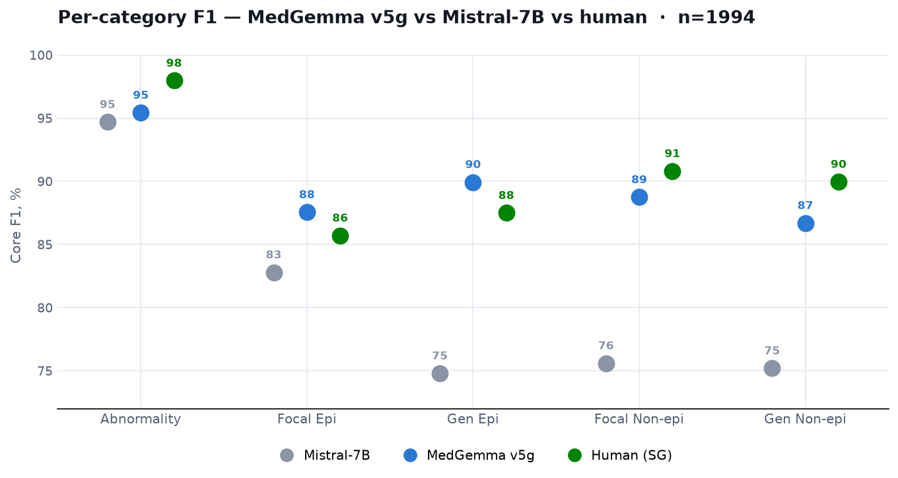

**What you see:** Core F1 for **each label scored on its own**, for our three strongest
prompts (**v5g**, **v3g**, **v7g**), Mistral-7B, and the human annotator. Note these are a
*different metric* from the first chart: the first chart's 87.6% is the share of reports
with **all five** labels correct at once; here each number is the F1 of **one** label —
so the two are not meant to match. Our prompts (blue / orange / violet)
**cluster tightly together and sit far above Mistral (grey)** on the harder three classes
(Gen Epi, Focal Non-epi, Gen Non-epi) — the gap to Mistral is 10–15 points there. Against
the **human (green)** the cluster lands right at the human level: **matching or beating
it on the epileptiform categories** (Focal Epi, Gen Epi) and trailing only on Abnormality
and the slowing classes — exactly where the two humans disagree most. That the three
prompts land so close to each other is itself the point: the result is stable across our
top variants, not a fluke of one prompt.

## Why we win — confidence, not just direction

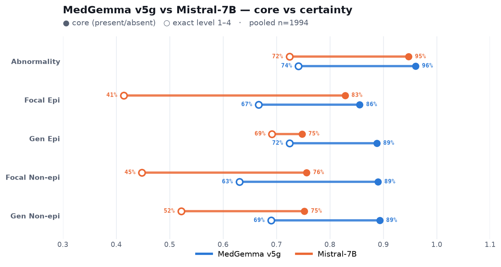

**What you see:** each line runs from **Core F1** (● — did we get present/absent right?)
to **Certainty F1** (○ — did we get the *exact* 1–4 confidence level?); the line length
is how much is lost when the exact level is required. Our **v5g (blue)** beats Mistral on
core almost everywhere, but the real separation is the **exact level**: Mistral's open
circles collapse (Focal Epi 83 → **41**, Focal Non-epi 76 → 45, Gen Non-epi 75 → 52) — it
points in the right direction but badly misjudges *how sure* to be — while v5g holds far
better (Focal Epi 86 → 67, Focal Non-epi 89 → 63). Getting the confidence level right, not
just the yes/no, is where our prompt+grammar approach pulls ahead.

## Which quantization, and does it generalize?

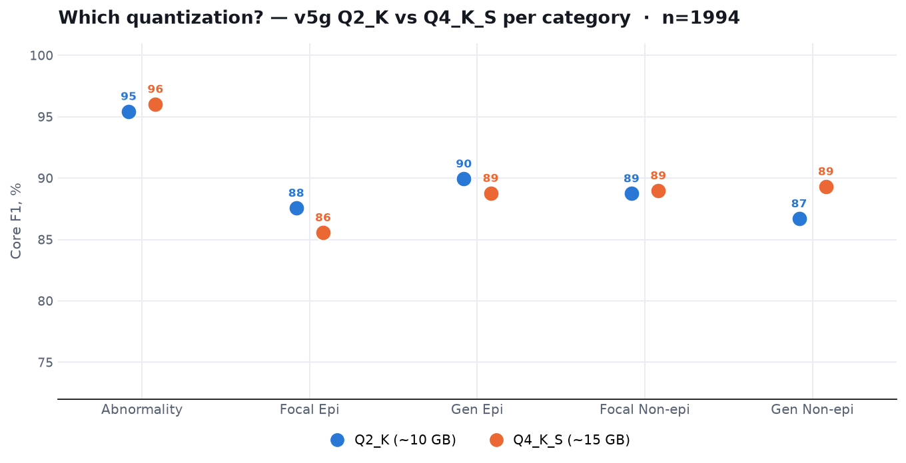

**What you see:** v5g on the two model sizes. They tie on whole-report accuracy (87.6%
each); per category **Q2_K** is stronger on the epileptiform classes (Focal Epi 88 vs 86)
while **Q4_K_S** is stronger on the diffuse/slowing classes (Gen Non-epi 89 vs 87). Pick
Q2_K for half the footprint, Q4_K_S if encephalopathy/diffuse findings matter most.

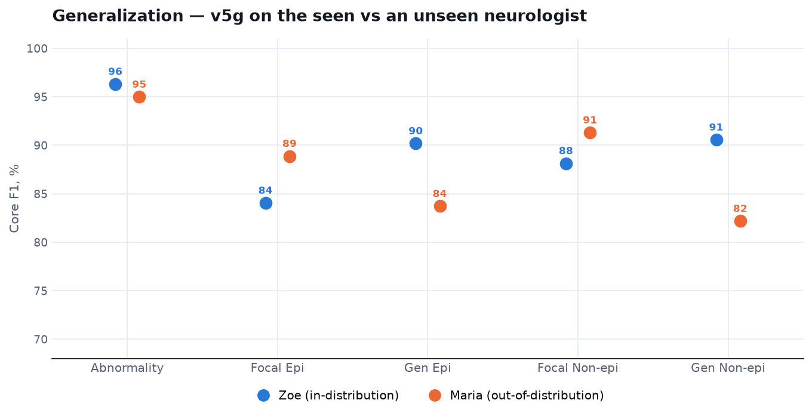

**What you see:** the same model on the **seen** neurologist (Zoe) and an **unseen** one
(Maria). Performance holds across reporting styles — the epileptiform and focal classes are
as strong or stronger on the unseen data — so the model generalizes rather than fitting one
annotator's phrasing.

## How the metrics work (read before the tables)

Every label uses the **1–4 scale** (1 confident-no · 2 low-no · 3 low-yes · 4 confident-yes).
We score with **F1 throughout**, at two strictness levels:

- **Core F1** — collapse to yes/no (1–2 = absent, 3–4 = present) and score how well
  "present" is detected. "3 vs 4" counts as correct (both mean present).
- **Certainty F1** — the exact 1–4 must match; "3 vs 4" is wrong (right direction, wrong
  confidence). The harder test — it shows whether the model captures *how sure* to be.

**Why F1, not plain accuracy?** The classes are very imbalanced (Focal/Gen Epi are present
in only ~5% of reports). Plain accuracy would score ~98% just by always predicting
"absent", hiding the failure to catch the rare findings. F1 = 2·TP / (2·TP + FP + FN)
ignores the easy true-negatives and measures only how well the *present* class is actually
caught (balancing precision and recall). It is the paper's core metric.

**The one exception is Whole-report (All-5)** — the share of reports where *all five* labels
are correct. That is an exact-match count by nature (there is no F1 for a whole report), so
it stays a plain percentage.

## Full numbers (pooled n=1994)

Per-category values are **Core F1**; "Whole" is **All-5 accuracy** (share of reports with
all five labels correct), vs LD and vs the held-out annotator SG.

| Prompt | Abnorm | Focal Epi | Gen Epi | Focal Non | Gen Non | Whole vs LD | Whole vs SG |
|---|---|---|---|---|---|---|---|
| Mistral-7B | 94.7 | 82.8 | 74.8 | 75.6 | 75.2 | 74.5 | — |
| v1 | 96.8 | 80.4 | 88.5 | 88.0 | 84.0 | 83.9 | 82.9 |
| v3 | 95.6 | 82.7 | 87.0 | 87.5 | 85.7 | 84.2 | 82.4 |
| v3g | 95.9 | 86.4 | 89.2 | 86.9 | 89.6 | 86.5 | 86.0 |
| **v5g Q2** | 95.4 | **87.6** | **89.9** | 88.8 | 86.7 | **87.6** | 85.6 |
| **v5g Q4** | 96.0 | 85.6 | 88.8 | 89.0 | 89.3 | **87.6** | **86.2** |
| v7g | 96.2 | 86.0 | 87.8 | 87.4 | 90.0 | 87.1 | 86.1 |
| v8g | 93.9 | 76.9 | 85.4 | 85.8 | 87.7 | 83.6 | 82.8 |
| v10g | 96.1 | 86.9 | 87.8 | 87.4 | 89.8 | 86.7 | 86.1 |
| Human SG | 98.0 | 85.7 | 87.5 | 90.8 | 90.0 | 89.8 | — |

(v9g omitted from the pooled table — it is much slower and did not finish the full run;
on a fair same-case comparison it was 3–6 points **below** v5g. Values shown use Q4 for
the grammar variants except where a quant is named.)

## Certainty (exact-level) F1

The Full-numbers table above is **Core F1**. Here is the same, per category, at the stricter
**Certainty** level — the exact 1–4 confidence must match. This is the harder test, and it is
where our approach separates most from Mistral.

| Model | Abnorm | Focal Epi | Gen Epi | Focal Non | Gen Non |
|---|---|---|---|---|---|
| Mistral-7B | 72.4 | 41.4 | 69.2 | 44.8 | 52.2 |
| v1 | 56.0 | 67.6 | 78.1 | 45.2 | 54.7 |
| v3 | 59.8 | 69.2 | 74.6 | 50.5 | 56.5 |
| v3g (Q4) | 75.6 | 66.3 | 75.9 | 60.6 | 67.1 |
| **v5g (Q2)** | 65.8 | 76.8 | 83.6 | 59.3 | 60.1 |
| **v5g (Q4)** | 74.1 | 66.7 | 72.4 | 63.1 | 69.0 |
| v7g (Q4) | 77.6 | 66.0 | 74.5 | 62.2 | 69.6 |
| v8g (Q4) | 61.6 | 59.4 | 73.4 | 50.4 | 61.1 |
| v10g (Q4) | 75.1 | 67.7 | 77.6 | 62.0 | 71.5 |
| Human (SG) | 92.0 | 72.0 | 84.1 | 46.9 | 58.3 |

The rare **epileptiform** classes are the story: at the exact level Mistral collapses (Focal
Epi 41) while our grammar prompts hold (66–77). On Abnormality the human is far ahead (92) —
judging *how sure* to be about "abnormal" is the hardest thing to imitate. On the slowing
classes even the human's certainty F1 is modest (Focal Non 47, Gen Non 58), and our models
sit at or above it.

Regenerate: `python -m analysis.f1_tables`.

## What worked, what didn't

- **Won:** the combination **v5 prompt + grammar-enforced consistency (v5g)**. The grammar
  is the single biggest lever — it removes every overall/subtype contradiction *and*, by
  letting the model decide the parts before the whole, lifts the epileptiform F1.
- **Rejected — asking instead of enforcing (v6):** the model doesn't hold the consistency
  rule on its own.
- **Rejected — body-aware abnormality (v7):** the remaining missed-abnormal cases are
  genuinely ambiguous, not a prompt gap.
- **Rejected — simplification (v8):** the detailed focal-epileptiform exclusions are
  load-bearing; removing them re-introduces over-calling.
- **Rejected — reasoning-first (v9):** given latitude to deliberate, the model's unaided
  judgement still under-performs the explicit rules by 3–6 points.
- **Rejected — evidence calibration (v10):** ~1 point below v5g on both quants; the
  "prefer absent" rule slightly hurt the rare Focal Epi class on Q2.

The improvement **holds against the held-out annotator SG** (82.9% → 86.2%), so it is a
real gain, not fitting to LD; the residual gap to the human is close to the level of
human–human disagreement, which is a reason to validate carefully rather than a claim that
nothing more is possible.

## Per-prompt detail — core vs certainty, Q2 vs Q4

One chart per prompt, each overlaying both quantizations. The **filled dot** is Core F1
(present/absent), the **open circle** is strict Certainty F1 (exact 1–4 level); the line
length is the drop when the exact level is required. All pooled over 1994 reports.

**v5g (best):**

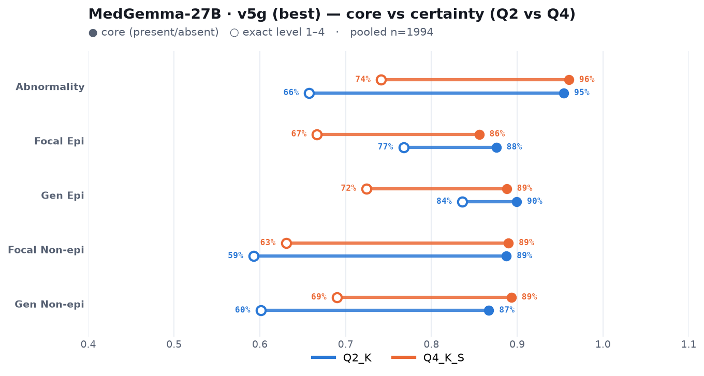

**v3g:**

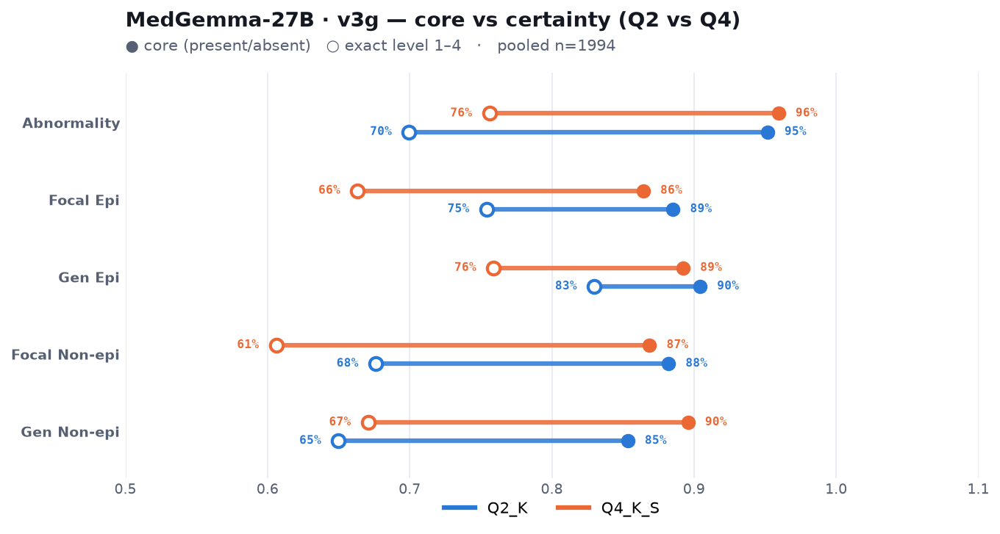

**v7g:**

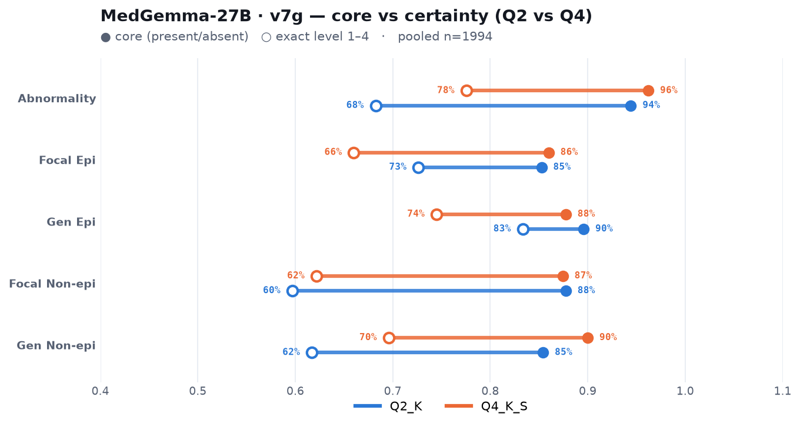

**v8g (simplified):**

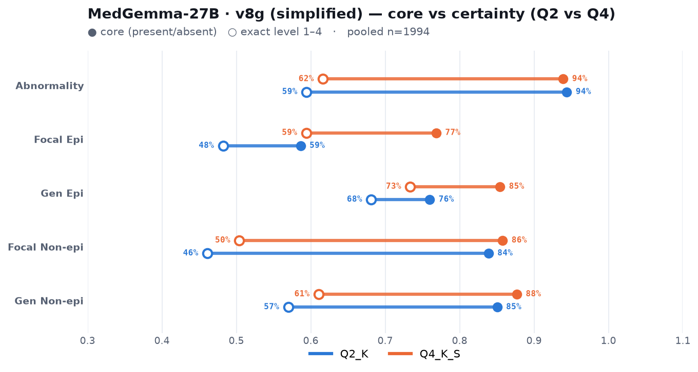

**v10g (calibrated):**

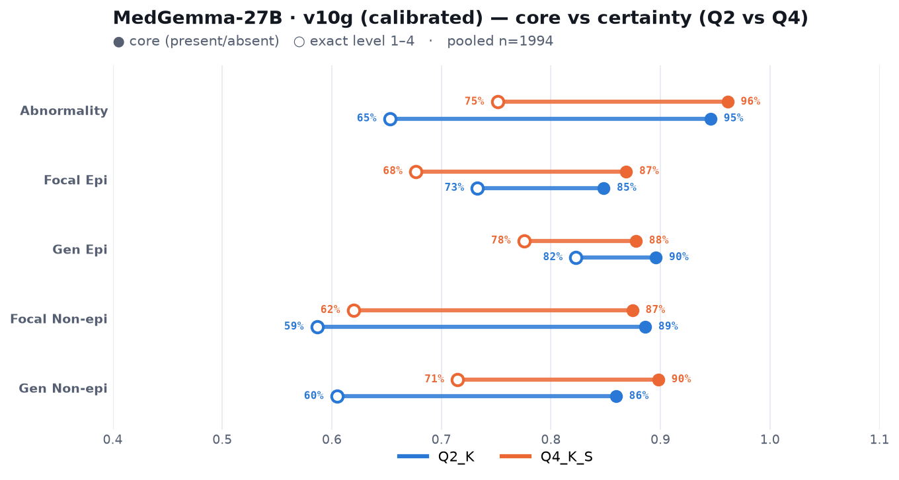

**Mistral-7B (reference):**

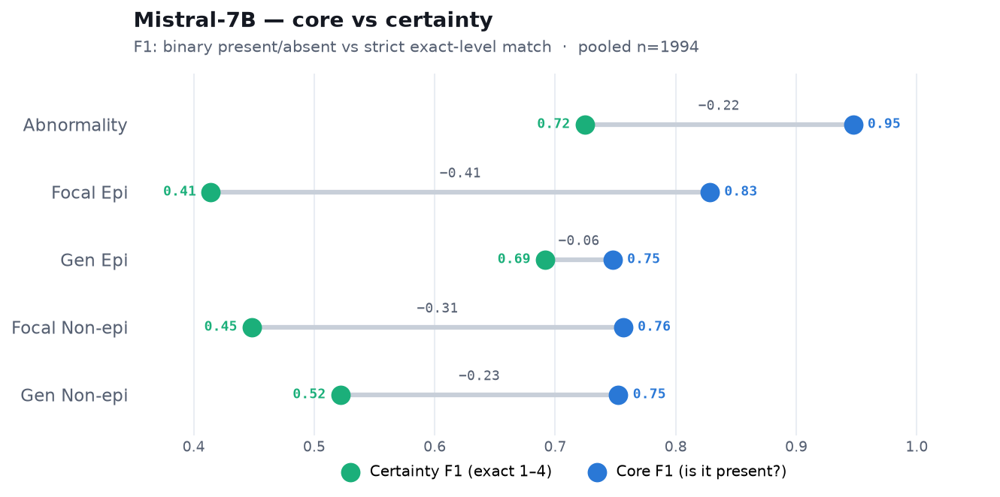

## Reproduce

```bash
pip install -e .
python -m analysis.make_tables         # the numbers tables
python -m analysis.plot_all_prompts    # every chart in this report -> reports/figures/
python -m analysis.validate_vs_sg      # cross-annotator validation
```
Per-run job IDs and hypotheses: [`../experiments/`](../experiments/). Model: MedGemma-27B
GGUF (Q2_K / Q4_K_S), llama.cpp grammar-constrained, temperature 0, 64-core CPU.
