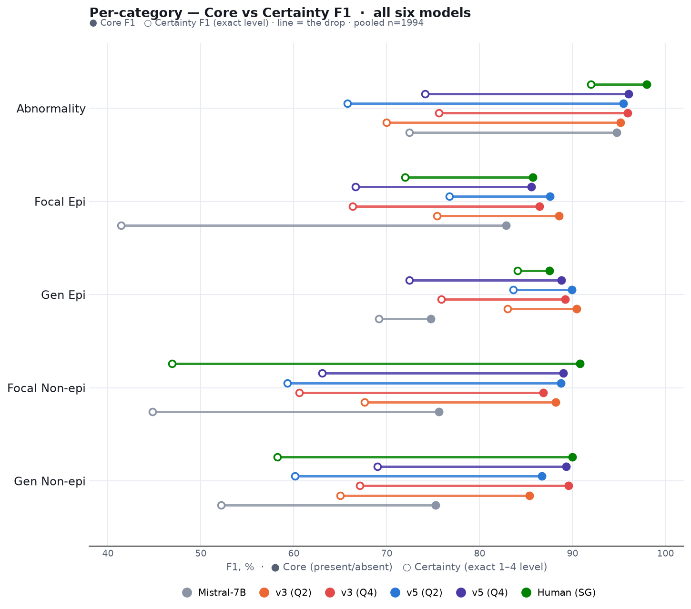
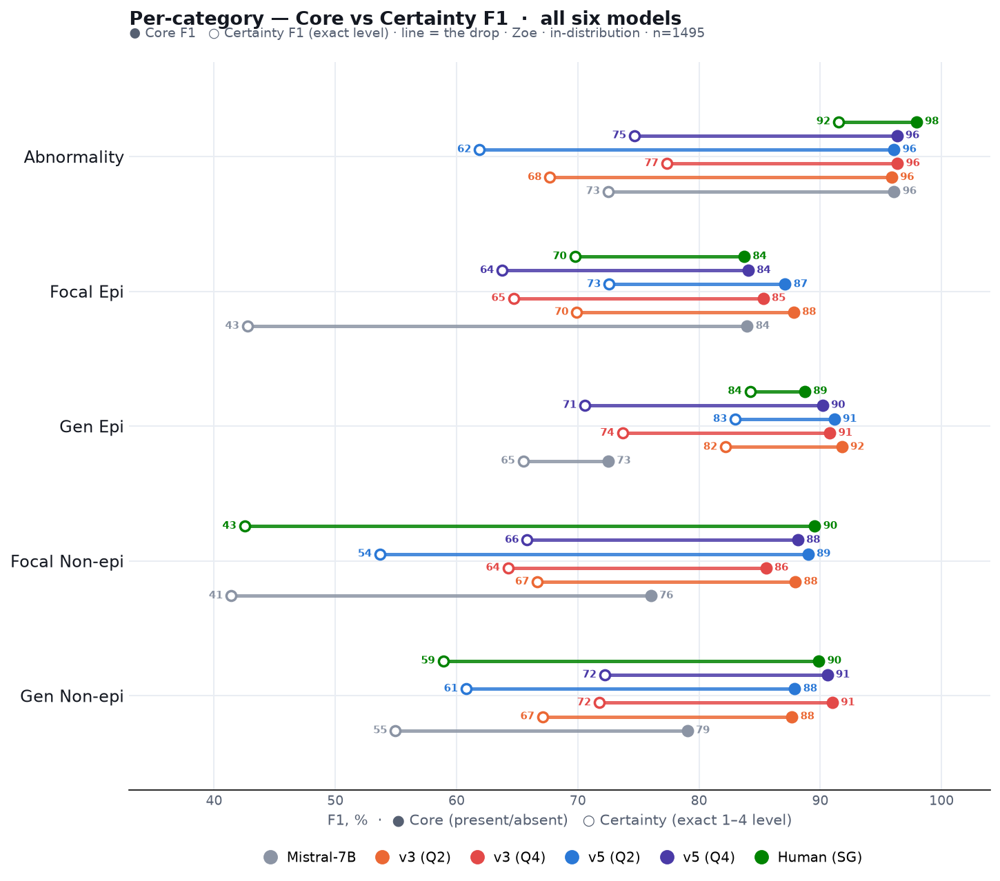
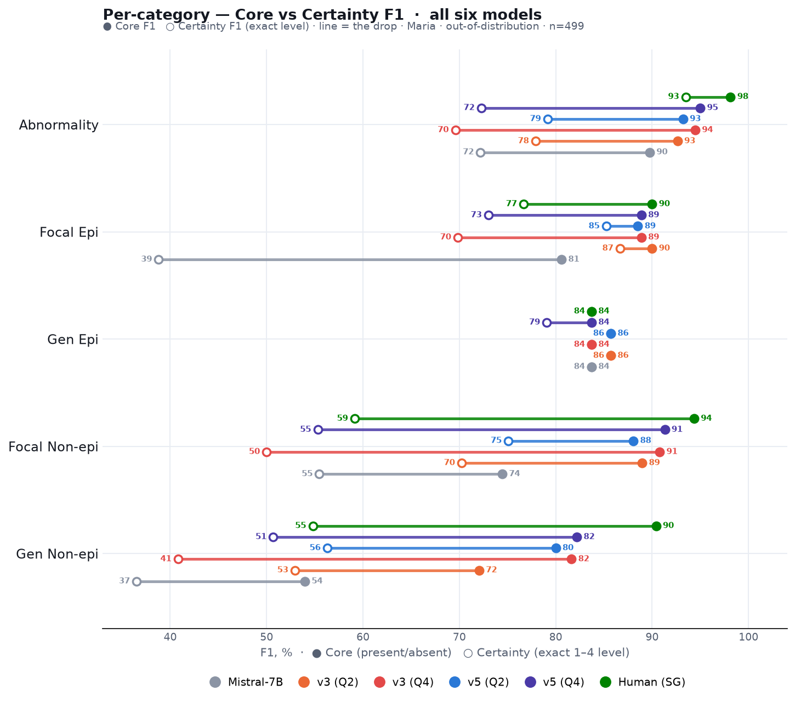

# All prompts — the full comparison

Every prompt we tried for MedGemma-27B, and how it did. All numbers are **pooled over
1994 reports** (Zoe n=1495 + Maria n=499), **Core F1** and whole-report accuracy vs the
reference annotator **LD**, with the second annotator **SG** held out. Baselines: the
paper's **Mistral-7B** (Tian et al.) and the **human** second annotator (SG vs LD).

## The prompts

| Prompt | Base | What it adds (technical) | Outcome |
|---|---|---|---|
| **v1** | — | Impression-first; short ACNS-style definitions; 5-label 1–4 schema; JSON output under a GBNF grammar | Baseline — 83.9% whole; already beats Mistral on 4/5 categories |
| **v2** | v1 | Neurologist *system* role; read Description/body **first**; keep body findings over a conservative Impression; extended ACNS/ILAE definitions | Helps Maria abnormality but **over-calls Focal Epi** → weaker overall |
| **v3** | v1 | Explicit **focal-epileptiform exclusion list**: generalized/bilateral discharges, "sharply-contoured"/benign variants, artifacts, and focal slowing all *≠* focal-epi | ↑ Focal-Epi precision without losing recall — **kept** |
| **v4** | v1 | Step-by-step epileptiform **procedure**: detect → localize (focal/generalized) → assign | ≈ v3, marginally worse |
| **v5** | v3 | **Focal-vs-generalized discriminator for slowing** (read distribution from the wording; forbid double-flagging one finding) | ↑ the slowing classes — **best prompt content** |
| **v6** | v3 | Prompt asks the model to **reconcile** overall/subtype consistency itself | **Rejected** — asking does not hold; even hurts other fields |
| **v7** | v5 | **Body-aware abnormality** — call it abnormal on a body finding the Impression downplays | **Rejected** — no gain on Abnormality |
| **v8** | — | Deliberately **simplified** (~340 tokens): only the two decision questions, no exclusion lists | **Rejected** — Focal-Epi collapses (exclusions are load-bearing) |
| **v9** | — | **Reasoning-first**: concise frame + a free-text `reasoning` field before the labels (larger max-tokens) | **Rejected** — 3–6 pts worse, much slower |
| **v10** | v5 | **Evidence-calibration** rule: tie confidence to explicit textual support; prefer *absent* when balanced | **Rejected** — ~1 pt below v5 |

A **`…g`** suffix (e.g. **v5g**) means the variant is run with **grammar-enforced
consistency** (`ENFORCE_CONSISTENCY=1`): a GBNF grammar emits `overall_abnormal` last and
only lets it be abnormal when a subtype is, so a self-contradictory answer is impossible
to produce. Full prompt texts are in [`../prompts/`](../prompts/).

## Where every prompt lands


**What you see:** whole-report accuracy (all five labels correct) for each configuration,
from Mistral-7B up to the human agreement line (89.8%, dotted). Our baseline **v1 already
clears Mistral by ~10 points.** Adding grammar-enforced consistency is the big step
(**v3g/v5g**), and **v5g (87.6%)** is the best — within ~2 points of the human ceiling.
The rejected ideas cluster below it: **v8 (simplified)** even falls *below* the v1
baseline, because dropping the detailed rules brings the over-calling straight back.

## Per category — Core and Certainty F1



**What you see:** each label scored on its own, for Mistral-7B, our **v3** and **v5**
prompts (both quantizations), and the human annotator. Every model is a dumbbell: the
**filled dot = Core F1** (present/absent — number on its right) and the **open dot =
Certainty F1** (exact 1–4 level — number on its left); the line length is the drop when the
exact confidence level is required. (These are per-label F1 — a *different metric* from the
first chart's whole-report %.)

Two things stand out. On **Core**, our prompts sit far above Mistral on the harder three
classes (Gen Epi, Focal Non-epi, Gen Non-epi) and at the human level on the epileptiform
classes. On **Certainty**, Mistral's open circles collapse (Focal Epi 41, Focal Non-epi 45)
while ours hold — the model captures not just the finding but *how sure* to be about it.

**Zoe (in-distribution, n=1495):**



**Maria (out-of-distribution, n=499):**



The picture holds on both neurologists: our prompts stay far above Mistral and near the
human on Core, and hold the Certainty level where Mistral drops.

## Why we win — confidence, not just direction


**What you see:** each line runs from **Core F1** (● — did we get present/absent right?)
to **Certainty F1** (○ — did we get the *exact* 1–4 confidence level?); the line length
is how much is lost when the exact level is required. Our **v5g (blue)** beats Mistral on
core almost everywhere, but the real separation is the **exact level**: Mistral's open
circles collapse (Focal Epi 83 → **41**, Focal Non-epi 76 → 45, Gen Non-epi 75 → 52) — it
points in the right direction but badly misjudges *how sure* to be — while v5g holds far
better (Focal Epi 86 → 67, Focal Non-epi 89 → 63). Getting the confidence level right, not
just the yes/no, is where our prompt+grammar approach pulls ahead.

## Which quantization, and does it generalize?


**What you see:** v5g on the two model sizes. They tie on whole-report accuracy (87.6%
each); per category **Q2_K** is stronger on the epileptiform classes (Focal Epi 88 vs 86)
while **Q4_K_S** is stronger on the diffuse/slowing classes (Gen Non-epi 89 vs 87). Pick
Q2_K for half the footprint, Q4_K_S if encephalopathy/diffuse findings matter most.


**What you see:** the same model on the **seen** neurologist (Zoe) and an **unseen** one
(Maria). Performance holds across reporting styles — the epileptiform and focal classes are
as strong or stronger on the unseen data — so the model generalizes rather than fitting one
annotator's phrasing.

## How the metrics work (read before the tables)

Every label uses the **1–4 scale** (1 confident-no · 2 low-no · 3 low-yes · 4 confident-yes).
We score with **F1 throughout**, at two strictness levels:

- **Core F1** — collapse to yes/no (1–2 = absent, 3–4 = present) and score how well
  "present" is detected. "3 vs 4" counts as correct (both mean present).
- **Certainty F1** — the exact 1–4 must match; "3 vs 4" is wrong (right direction, wrong
  confidence). The harder test — it shows whether the model captures *how sure* to be.

**Why F1, not plain accuracy?** The classes are very imbalanced (Focal/Gen Epi are present
in only ~5% of reports). Plain accuracy would score ~98% just by always predicting
"absent", hiding the failure to catch the rare findings. F1 = 2·TP / (2·TP + FP + FN)
ignores the easy true-negatives and measures only how well the *present* class is actually
caught (balancing precision and recall). It is the paper's core metric.

**The one exception is Whole-report (All-5)** — the share of reports where *all five* labels
are correct. That is an exact-match count by nature (there is no F1 for a whole report), so
it stays a plain percentage.

## Full numbers (pooled n=1994)

Per-category values are **Core F1**; "Whole" is **All-5 accuracy** (share of reports with
all five labels correct), vs LD and vs the held-out annotator SG.

| Prompt | Abnorm | Focal Epi | Gen Epi | Focal Non | Gen Non | Whole vs LD | Whole vs SG |
|---|---|---|---|---|---|---|---|
| Mistral-7B | 94.7 | 82.8 | 74.8 | 75.6 | 75.2 | 74.5 | — |
| v1 | 96.8 | 80.4 | 88.5 | 88.0 | 84.0 | 83.9 | 82.9 |
| v3 | 95.6 | 82.7 | 87.0 | 87.5 | 85.7 | 84.2 | 82.4 |
| v3g | 95.9 | 86.4 | 89.2 | 86.9 | 89.6 | 86.5 | 86.0 |
| **v5g Q2** | 95.4 | **87.6** | **89.9** | 88.8 | 86.7 | **87.6** | 85.6 |
| **v5g Q4** | 96.0 | 85.6 | 88.8 | 89.0 | 89.3 | **87.6** | **86.2** |
| v7g | 96.2 | 86.0 | 87.8 | 87.4 | 90.0 | 87.1 | 86.1 |
| v8g | 93.9 | 76.9 | 85.4 | 85.8 | 87.7 | 83.6 | 82.8 |
| v10g | 96.1 | 86.9 | 87.8 | 87.4 | 89.8 | 86.7 | 86.1 |
| Human SG | 98.0 | 85.7 | 87.5 | 90.8 | 90.0 | 89.8 | — |

(v9g omitted from the pooled table — it is much slower and did not finish the full run;
on a fair same-case comparison it was 3–6 points **below** v5g. Values shown use Q4 for
the grammar variants except where a quant is named.)

### By dataset — Zoe (in-distribution, n=1495)

| Prompt | Abnorm | Focal Epi | Gen Epi | Focal Non | Gen Non | Whole vs LD | Whole vs SG |
|---|---|---|---|---|---|---|---|
| Mistral-7B | 96.1 | 84.0 | 72.5 | 76.0 | 79.0 | 75.3 | — |
| v1 | 98.1 | 76.8 | 89.9 | 87.1 | 85.5 | 83.9 | 82.9 |
| v3 | 96.9 | 79.5 | 87.4 | 87.6 | 87.8 | 85.1 | 82.9 |
| v3g | 96.4 | 85.3 | 90.8 | 85.5 | 91.0 | 86.1 | 85.5 |
| **v5g Q2** | 96.1 | 87.1 | 91.2 | 89.0 | 87.9 | **87.8** | 85.8 |
| **v5g Q4** | 96.3 | 84.1 | 90.2 | 88.1 | 90.6 | 87.2 | 85.6 |
| v7g | 96.6 | 84.7 | 88.9 | 86.5 | 91.7 | 86.8 | 85.9 |
| v8g | 93.7 | 72.5 | 85.9 | 83.9 | 88.9 | 82.2 | 81.7 |
| v10g | 96.5 | 85.9 | 88.9 | 86.7 | 90.9 | 86.2 | 85.4 |
| Human (SG) | 97.9 | 83.7 | 88.7 | 89.5 | 89.9 | 88.8 | — |

### By dataset — Maria (out-of-distribution, n=499)

| Prompt | Abnorm | Focal Epi | Gen Epi | Focal Non | Gen Non | Whole vs LD | Whole vs SG |
|---|---|---|---|---|---|---|---|
| Mistral-7B | 89.8 | 80.6 | 83.7 | 74.5 | 54.0 | 71.9 | — |
| v1 | 92.2 | 88.2 | 83.7 | 90.5 | 75.0 | 83.6 | 83.2 |
| v3 | 90.8 | 90.3 | 85.7 | 87.2 | 73.4 | 81.6 | 81.0 |
| v3g | 94.5 | 88.9 | 83.7 | 90.8 | 81.6 | 87.8 | 87.6 |
| **v5g Q2** | 93.2 | 88.5 | 85.7 | 88.1 | 80.0 | 86.8 | 85.2 |
| **v5g Q4** | 95.0 | 88.9 | 83.7 | 91.3 | 82.2 | **88.8** | **88.0** |
| v7g | 94.8 | 88.9 | 83.7 | 90.1 | 80.6 | 87.8 | 86.8 |
| v8g | 94.7 | 87.0 | 83.7 | 91.1 | 80.8 | 87.8 | 86.4 |
| v10g | 94.8 | 88.9 | 83.7 | 89.4 | 83.6 | 88.2 | 88.0 |
| Human (SG) | 98.1 | 90.0 | 83.7 | 94.4 | 90.4 | 92.8 | — |

The model **generalizes**: on the unseen neurologist (Maria) the epileptiform and
focal-non classes are as strong as on Zoe, and v5g still tracks the human. Gen Non-epi is
the one class that is harder OOD (it is rarer on Maria, ~15%).

## Certainty (exact-level) F1

The Full-numbers table above is **Core F1**. Here is the same, per category, at the stricter
**Certainty** level — the exact 1–4 confidence must match. This is the harder test, and it is
where our approach separates most from Mistral. The **Whole** column = share of reports with
all five *exact* levels correct (an accuracy — there is no F1 for a whole report).

| Model | Abnorm | Focal Epi | Gen Epi | Focal Non | Gen Non | Whole |
|---|---|---|---|---|---|---|
| Mistral-7B | 72.4 | 41.4 | 69.2 | 44.8 | 52.2 | 40.7 |
| v1 | 56.0 | 67.6 | 78.1 | 45.2 | 54.7 | 56.8 |
| v3 | 59.8 | 69.2 | 74.6 | 50.5 | 56.5 | 59.1 |
| v3g | 75.6 | 66.3 | 75.9 | 60.6 | 67.1 | 66.8 |
| **v5g (Q2)** | 65.8 | 76.8 | 83.6 | 59.3 | 60.1 | 66.5 |
| **v5g (Q4)** | 74.1 | 66.7 | 72.4 | 63.1 | 69.0 | 67.9 |
| v7g | 77.6 | 66.0 | 74.5 | 62.2 | 69.6 | 69.9 |
| v8g | 61.6 | 59.4 | 73.4 | 50.4 | 61.1 | 61.1 |
| v10g | 75.1 | 67.7 | 77.6 | 62.0 | 71.5 | 67.5 |
| Human (SG) | 92.0 | 72.0 | 84.1 | 46.9 | 58.3 | 65.9 |

The rare **epileptiform** classes are the story: at the exact level Mistral collapses (Focal
Epi 41) while our grammar prompts hold (66–77). On Abnormality the human is far ahead (92) —
judging *how sure* to be about "abnormal" is the hardest thing to imitate. On the slowing
classes even the human's certainty F1 is modest (Focal Non 47, Gen Non 58), and our models
sit at or above it.

### Certainty — Zoe (in-distribution, n=1495)

| Model | Abnorm | Focal Epi | Gen Epi | Focal Non | Gen Non | Whole |
|---|---|---|---|---|---|---|
| Mistral-7B | 72.5 | 42.7 | 65.5 | 41.4 | 55.0 | 40.4 |
| v1 | 53.1 | 60.9 | 76.5 | 39.5 | 56.4 | 53.4 |
| v3 | 56.7 | 63.0 | 71.5 | 44.6 | 59.0 | 56.0 |
| v3g | 77.3 | 64.7 | 73.7 | 64.3 | 71.8 | 66.0 |
| **v5g (Q2)** | 61.9 | 72.6 | 83.0 | 53.7 | 60.8 | 62.9 |
| **v5g (Q4)** | 74.7 | 63.8 | 70.6 | 65.8 | 72.2 | 66.4 |
| v7g | 78.6 | 61.3 | 73.2 | 63.8 | 73.0 | 68.6 |
| v8g | 57.1 | 55.0 | 71.8 | 42.7 | 61.6 | 57.0 |
| v10g | 75.5 | 63.7 | 75.8 | 64.3 | 73.9 | 66.0 |
| Human (SG) | 91.5 | 69.8 | 84.2 | 42.5 | 58.9 | 63.5 |

### Certainty — Maria (out-of-distribution, n=499)

| Model | Abnorm | Focal Epi | Gen Epi | Focal Non | Gen Non | Whole |
|---|---|---|---|---|---|---|
| Mistral-7B | 72.2 | 38.8 | 83.7 | 55.5 | 36.5 | 41.5 |
| v1 | 66.7 | 82.4 | 83.7 | 61.5 | 44.1 | 66.9 |
| v3 | 71.3 | 83.9 | 85.7 | 67.4 | 41.7 | 68.3 |
| v3g | 69.6 | 69.8 | 83.7 | 50.0 | 40.8 | 69.1 |
| **v5g (Q2)** | 79.2 | 85.2 | 85.7 | 75.1 | 56.3 | 77.4 |
| **v5g (Q4)** | 72.3 | 73.0 | 79.1 | 55.3 | 50.7 | 72.5 |
| v7g | 73.9 | 76.2 | 79.1 | 57.5 | 50.0 | 73.7 |
| v8g | 77.8 | 69.6 | 79.1 | 72.8 | 58.3 | 73.5 |
| v10g | 73.9 | 76.2 | 83.7 | 55.3 | 57.5 | 71.9 |
| Human (SG) | 93.5 | 76.7 | 83.7 | 59.1 | 54.8 | 73.3 |

Regenerate: `python -m analysis.f1_tables`.

## Full matrix — every prompt × quantization

All variants at both model sizes (Core F1 vs LD, pooled n=1994). The grammar-enforced
variants (`…g`) are the strong ones; the plain prompts (v1–v6) are shown for completeness.

| Prompt | Quant | Abnorm | Focal Epi | Gen Epi | Focal Non | Gen Non | Whole |
|---|---|---|---|---|---|---|---|
| v1 | Q2_K | 96.8 | 80.4 | 88.5 | 88.0 | 84.0 | 83.9 |
| v1 | Q4_K_S | 97.8 | 73.2 | 87.3 | 84.7 | 88.9 | 81.3 |
| v2 | Q2_K | 97.6 | 63.6 | 88.1 | 85.9 | 82.4 | 79.0 |
| v2 | Q4_K_S | 98.1 | 70.2 | 88.5 | 85.8 | 89.0 | 82.8 |
| v3 | Q2_K | 95.6 | 82.7 | 87.0 | 87.5 | 85.7 | 84.2 |
| v3 | Q4_K_S | 96.8 | 81.7 | 88.1 | 85.8 | 89.4 | 83.2 |
| v4 | Q2_K | 96.0 | 82.5 | 86.8 | 87.3 | 86.6 | 83.4 |
| v4 | Q4_K_S | 97.1 | 79.3 | 87.6 | 84.1 | 89.0 | 81.1 |
| v5 | Q2_K | 92.6 | 82.5 | 89.0 | 88.8 | 86.8 | 82.8 |
| v5 | Q4_K_S | 97.1 | 82.9 | 87.6 | 88.3 | 88.1 | 84.7 |
| v6 | Q2_K | 93.6 | 83.8 | 88.0 | 83.6 | 85.1 | 82.0 |
| v6 | Q4_K_S | 97.0 | 83.8 | 88.7 | 87.7 | 88.1 | 84.6 |
| **v3g** | Q2_K | 95.2 | 88.5 | 90.4 | 88.2 | 85.3 | 86.1 |
| **v3g** | Q4_K_S | 95.9 | 86.4 | 89.2 | 86.9 | 89.6 | 86.5 |
| **v5g** | Q2_K | 95.4 | 87.6 | 89.9 | 88.8 | 86.7 | **87.6** |
| **v5g** | Q4_K_S | 96.0 | 85.6 | 88.8 | 89.0 | 89.3 | **87.6** |
| v7g | Q2_K | 94.4 | 85.3 | 89.6 | 87.8 | 85.4 | 86.1 |
| v7g | Q4_K_S | 96.2 | 86.0 | 87.8 | 87.4 | 90.0 | 87.1 |
| v8g | Q2_K | 94.4 | 58.6 | 76.0 | 83.9 | 85.0 | 79.3 |
| v8g | Q4_K_S | 93.9 | 76.9 | 85.4 | 85.8 | 87.7 | 83.6 |
| v10g | Q2_K | 94.6 | 84.8 | 89.6 | 88.6 | 85.9 | 86.5 |
| v10g | Q4_K_S | 96.1 | 86.9 | 87.8 | 87.4 | 89.8 | 86.7 |

(v9g omitted — the reasoning-first run is much slower and did not finish; on a fair
same-case comparison it was 3–6 points below v5g.)

## What worked, what didn't

- **Won:** the combination **v5 prompt + grammar-enforced consistency (v5g)**. The grammar
  is the single biggest lever — it removes every overall/subtype contradiction *and*, by
  letting the model decide the parts before the whole, lifts the epileptiform F1.
- **Rejected — asking instead of enforcing (v6):** the model doesn't hold the consistency
  rule on its own.
- **Rejected — body-aware abnormality (v7):** the remaining missed-abnormal cases are
  genuinely ambiguous, not a prompt gap.
- **Rejected — simplification (v8):** the detailed focal-epileptiform exclusions are
  load-bearing; removing them re-introduces over-calling.
- **Rejected — reasoning-first (v9):** given latitude to deliberate, the model's unaided
  judgement still under-performs the explicit rules by 3–6 points.
- **Rejected — evidence calibration (v10):** ~1 point below v5g on both quants; the
  "prefer absent" rule slightly hurt the rare Focal Epi class on Q2.

The improvement **holds against the held-out annotator SG** (82.9% → 86.2%), so it is a
real gain, not fitting to LD; the residual gap to the human is close to the level of
human–human disagreement, which is a reason to validate carefully rather than a claim that
nothing more is possible.

## Per-prompt detail — core vs certainty, Q2 vs Q4

One chart per prompt, each overlaying both quantizations. The **filled dot** is Core F1
(present/absent), the **open circle** is strict Certainty F1 (exact 1–4 level); the line
length is the drop when the exact level is required. All pooled over 1994 reports.

**v5g (best):**


**v3g:**


**v7g:**


**v8g (simplified):**


**v10g (calibrated):**


**Mistral-7B (reference):**


## Reproduce

```bash
pip install -e .
python -m analysis.make_tables         # the numbers tables
python -m analysis.plot_all_prompts    # every chart in this report -> reports/figures/
python -m analysis.validate_vs_sg      # cross-annotator validation
```
Per-run job IDs and hypotheses: [`../experiments/`](../experiments/). Model: MedGemma-27B
GGUF (Q2_K / Q4_K_S), llama.cpp grammar-constrained, temperature 0, 64-core CPU.
