# EEG Report Classification — Full Results (MedGemma-27B)

Classifying free-text clinical EEG reports into five diagnostic categories with
**MedGemma-27B** on CPU (llama.cpp, GBNF grammar-constrained, temperature 0).
Ground truth is annotator **LD** (Reference Annotator); **SG** (Second Annotator)
is the human ceiling; the paper's **Mistral-7B** (Tian et al., Table III) is the
external baseline.

We ran the **full 2×2×2 matrix** — everything is computed from `results/*.json`:

| Axis | Options |
|---|---|
| **Prompt** | `v1` (original, Impression-first) · `v2` (professor's: neurologist system role, body-first extraction, extended clinical definitions) |
| **Dataset** | `Zoe` (n=1495, in-distribution) · `Maria` (n=499, out-of-distribution — a different neurologist) |
| **Quantization** | `Q2_K` (~10 GB) · `Q4_K_S` (~15 GB) |

> **Headline:** on both datasets our small quantized model **matches or beats the
> paper's Mistral-7B** and approaches the **human** ceiling on the main
> "abnormal vs normal" call. Q2_K is enough (Q4_K_S is no better). The professor's
> v2 prompt is a **trade-off** — it helps overall abnormality (especially on Maria)
> but hurts the rare Focal Epi class.

Metric throughout: **Core F1** vs LD (binary present/absent, score ≥ 3 = present).

---

# Headline — our best model vs Mistral-7B (all data pooled)

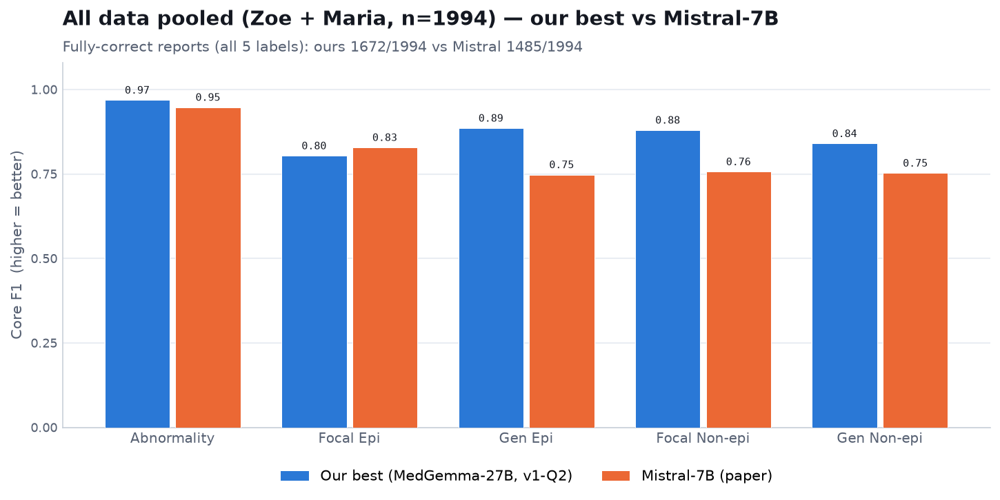

**What it shows:** all **1994 reports** (1495 Zoe + 499 Maria) pooled into one set,
comparing our best configuration (Q2_K, prompt v1) with the paper's Mistral-7B.
Both are scored against LD. **F1 is pooled correctly** — raw TP/FP/FN are summed
across the two datasets and F1 is computed once (not an average of the two
datasets' F1). Mistral's numbers use its **actual predictions** on the same 1994
reports (from the released classification database), verified to reproduce the
paper's Table III per-dataset F1.

**What you see:** across all data our model **beats Mistral-7B on 4 of 5
categories** — decisively on the three harder ones (Gen Epi 0.89 vs 0.75,
Focal Non-epi 0.88 vs 0.76, Gen Non-epi 0.84 vs 0.75) and slightly higher on
Abnormality (0.97 vs 0.95). Mistral edges ahead only on the rare Focal Epi
(0.83 vs 0.80). Overall, **1672 / 1994 reports fully correct (all 5 labels) vs
Mistral's 1485** — a clear net improvement from a small, CPU-only, quantized model.

## How exactly do we match the expert? — core vs exact level

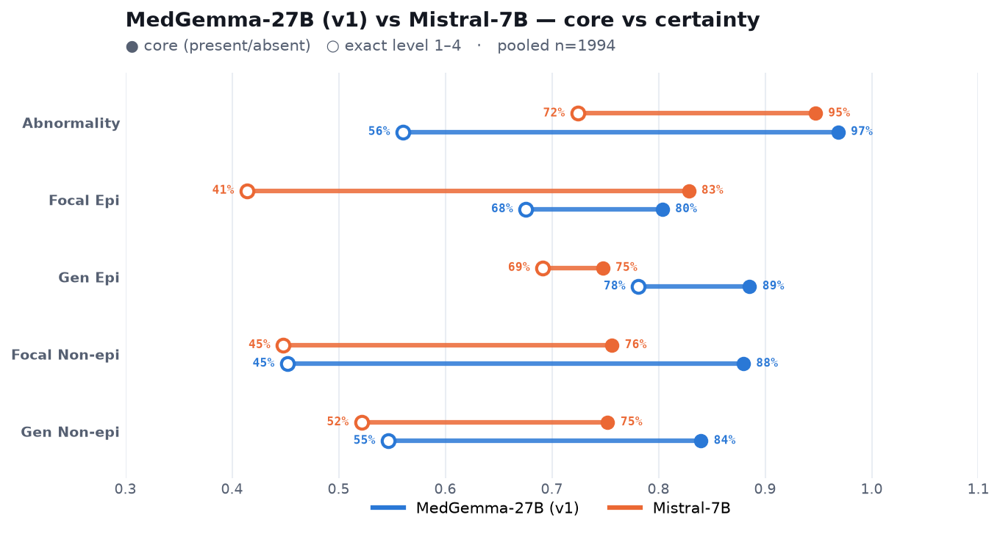

**What it shows:** MedGemma-27B (v1, blue) and Mistral-7B (orange) on one chart, all
1994 reports. Each line runs from **Core F1** (● — did we get present/absent right)
to **Certainty F1** (○ — did we get the *exact* level 1/2/3/4). **The line length is
the gap** — how much is lost when the exact confidence level is required.

**What you see:** on **core** both models sit far right; MedGemma is above Mistral on
four of five categories. On the exact level the difference grows: on **Focal Epi**
Mistral's line is huge (0.83 → **0.41**) — it gets the direction right but badly
misses the level — while MedGemma barely drops (0.80 → 0.67). Same story on the
non-epileptiform classes. The one place Mistral is better on the exact level is
**Abnormality** (0.72 vs our 0.56) — judging *how sure* to be about "abnormal" is the
hardest thing to imitate, exactly the gap the paper highlights.

---

# Part 1 — Both datasets (Zoe + Maria)

## 1.1 Our model vs Mistral-7B vs human

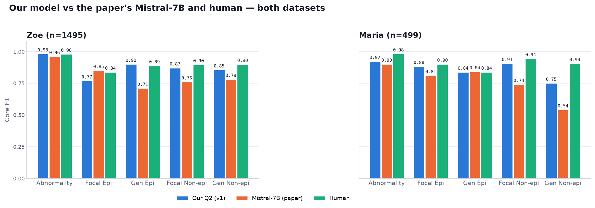

**What it shows:** Core F1 per category for our Q2 model (v1), the paper's
Mistral-7B, and the human second annotator — on each dataset.

**What you see:** on **Zoe** we match/beat Mistral on 4/5 categories and equal the
human on Abnormality (0.98). On **Maria** (a neurologist the model never saw) we
still beat Mistral on 4/5 and stay close to human — the model generalizes rather
than memorizing one reporting style.

## 1.2 Generalization: Zoe vs Maria

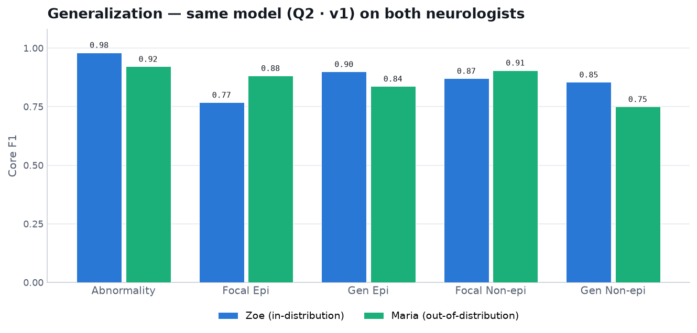

**What it shows:** the same model (Q2 · v1) on both neurologists, side by side.

**What you see:** performance holds across styles. Abnormality drops a little on
Maria (0.98 → 0.92) and Gen Non-epi is harder (0.85 → 0.75), but epileptiform and
focal-non-epileptiform stay strong — no collapse on out-of-distribution data.

## 1.3 Confidence stays meaningful

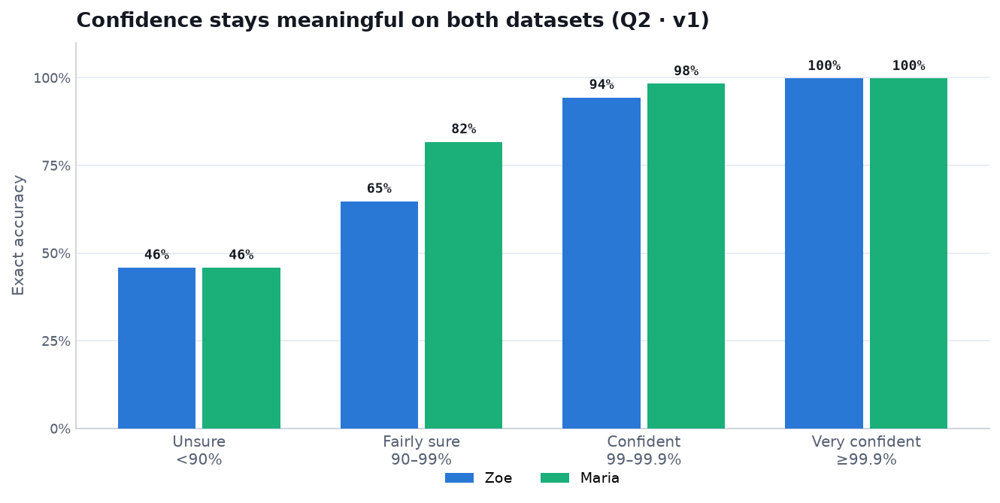

**What it shows:** exact-match accuracy grouped by how confident the model is, on
each dataset.

**What you see:** on both Zoe and Maria, accuracy climbs steeply with confidence —
unsure predictions are right ~half the time, very confident ones ~100%. The
model's uncertainty is usable as a "route to a human" signal on new data too.

---

# Part 2 — Zoe (n=1495, in-distribution)

## 2.1 Accuracy by category

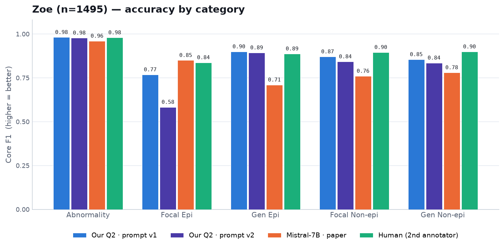

**What you see:** Abnormality is at the human ceiling (0.98). The only real weak
spot is **Focal Epi** (0.77) — a rare class where F1 is precision-limited. Prompt
v2 (violet) lowers Focal Epi further (0.77 → 0.58); see 2.2.

## 2.2 Effect of the professor's v2 prompt

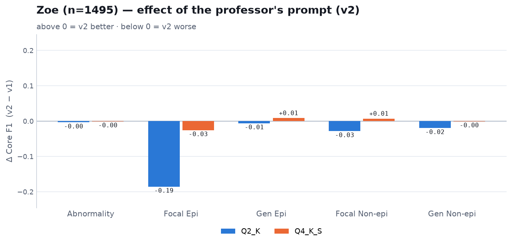

**What it shows:** change in Core F1 from v1 to v2 (above 0 = v2 better).

**What you see:** on Zoe, v2 is mostly slightly negative, with a large drop on
**Focal Epi**. Telling the model to read the report body first and not discard body
findings makes it flag focal epileptiform activity more aggressively — more false
alarms on an already precision-limited rare class. Fully-correct reports:
v1 1255 → v2 1159.

## 2.3 Quantization: Q2_K vs Q4_K_S

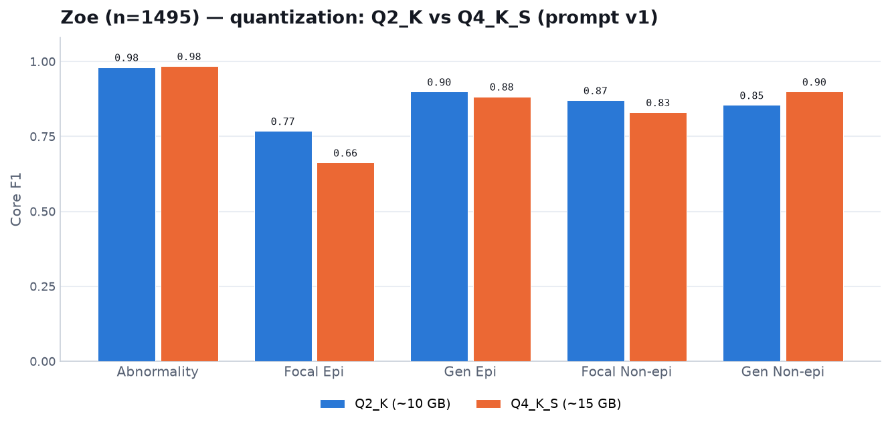

**What you see:** the larger Q4_K_S is **not** better overall (and it's slower to
build/copy and ~50% larger). Q2_K is the right default.

## 2.4 Over- vs under-calling

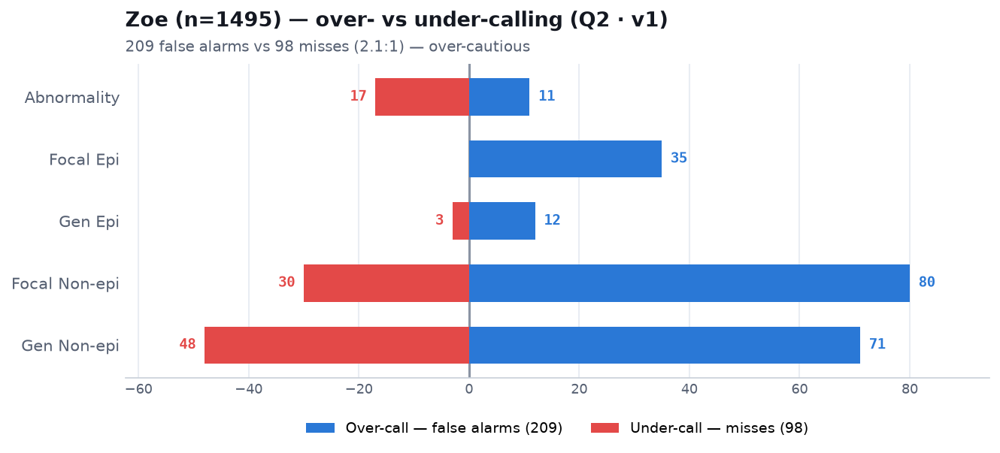

**What you see:** on Zoe the model is **over-cautious** — 209 false alarms vs 98
misses (~2:1), concentrated in the non-epileptiform categories. Clinically the
safer bias (an extra check beats a missed finding).

---

# Part 3 — Maria (n=499, out-of-distribution)

## 3.1 Accuracy by category

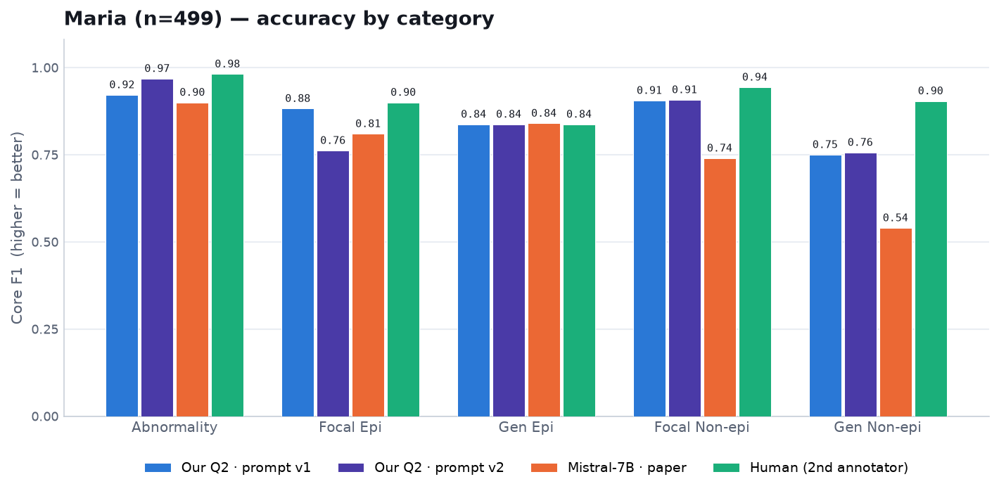

**What you see:** the model holds up on an unseen neurologist — beating Mistral on
4/5. Abnormality 0.92 (Mistral 0.90; human 0.98). Here prompt **v2 helps**
Abnormality (0.92 → 0.97, near human) — the opposite direction to Zoe.

## 3.2 Effect of the professor's v2 prompt

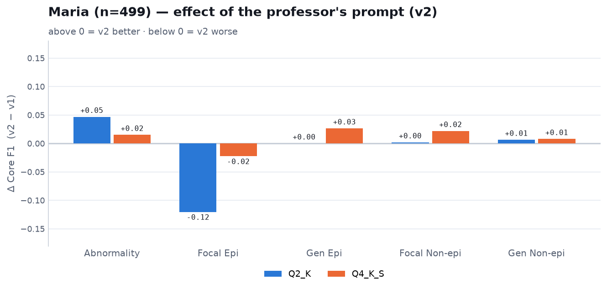

**What you see:** on Maria, v2 **improves Abnormality (+0.05)** and most other
categories, but again **hurts Focal Epi (−0.12)**. The best single config by
fully-correct reports is **v2 + Q4_K_S (437/499)**.

## 3.3 Quantization: Q2_K vs Q4_K_S

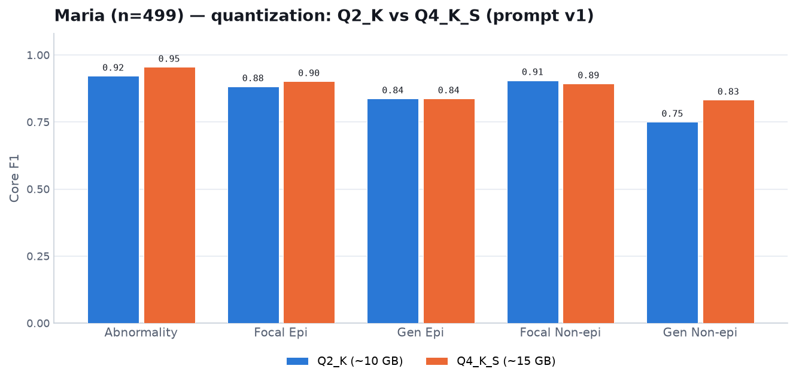

**What you see:** on Maria, Q4_K_S is a bit better on the two hardest categories
(Gen Non-epi 0.75 → 0.83), but the difference is small.

## 3.4 Over- vs under-calling

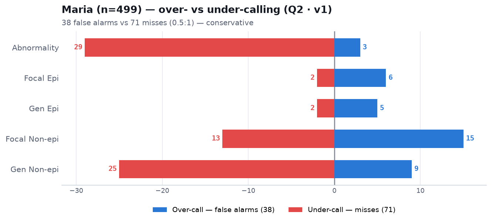

**What you see:** the key OOD difference — on Maria the model is **conservative**
(38 false alarms vs 71 misses, 0.5:1), the **opposite** of Zoe. It misses more
overall-abnormal (29) and diffuse-slowing (25) cases. This is exactly why v2 —
which says "do not discard a body finding when the Impression is conservative" —
raises Maria's Abnormality: it converts some of those misses into correct calls.

---

## Categories at a glance

| Category | One-line meaning |
|---|---|
| **Abnormality** | Is the EEG abnormal at all. |
| **Focal Epi** | Epileptiform discharges (spikes) in **one region**. |
| **Gen Epi** | The same, but **across the whole brain**. |
| **Focal Non-epi** | Non-epileptic disturbance (slowing) in **one region**. |
| **Gen Non-epi** | Non-epileptic disturbance **diffusely** (e.g. encephalopathy). |

## Prompts

<details>
<summary><b>v1 (baseline) and v2 (professor's) prompts</b></summary>

Both live in [core/prompt.py](core/prompt.py), selected by the `PROMPT_VARIANT`
env var. v1 uses a short definitions block and treats the Impression as the primary
source; v2 moves the neurologist role into a `system` message, reads the report
body first for the four subtypes, keeps body findings even when the Impression is
conservative, and uses an extended ACNS/ILAE-based definitions block. Full text:
`python -c "import core.prompt as p; print(p.PROMPT_PREFIX); print(p.PROMPT_PREFIX_V2)"`.

</details>

## Reproduce

Every figure and number regenerates from the result JSONs:

```bash
source .venv/bin/activate
python -m analysis.plot_full          # all figures in this report

# a run (dataset / quant / prompt are env-selected):
DATASET=maria GGUF_QUANT=Q4_K_S PROMPT_VARIANT=v2 CTX_SIZE=8192 \
  sbatch cpu/run_benchmark.sbatch 0 499 results/out.json
```

| Config | Result file |
|---|---|
| Zoe · v1 · Q2 / Q4 | `q2_cpu_full_n1495.json` · `cpu_q4_k_s_full_n1495.json` |
| Zoe · v2 · Q2 / Q4 | `zoe_v2_cpu_q2_k_full_n1495.json` · `zoe_v2_cpu_q4_k_s_full_n1495.json` |
| Maria · v1 · Q2 / Q4 | `maria_cpu_q2_k_full_n499.json` · `maria_cpu_q4_k_s_full_n499.json` |
| Maria · v2 · Q2 / Q4 | `maria_v2_cpu_q2_k_full_n499.json` · `maria_v2_cpu_q4_k_s_full_n499.json` |

Model: MedGemma-27B GGUF (Q2_K / Q4_K_S), llama.cpp grammar-constrained, temp 0,
64-core CPU (`rrg-rmcintos_cpu`). Runtimes: Zoe ~4.5–5 h, Maria ~1.5 h per run.
