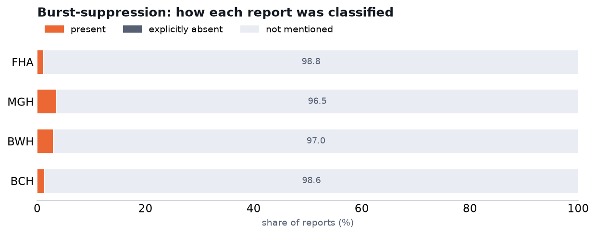

# Burst-suppression — labeling clinical EEG reports, and comparison with Harvard

We labeled every report for whether it explicitly describes a **burst-suppression** (or
suppression-burst) pattern. Three-way call: the report describes it (`present`), the report says it
is absent (`explicitly_absent`), or it isn't mentioned (`not_mentioned`). Vasily's suggested prompt,
used verbatim, grammar-constrained so the answer is exactly one of those three. MedGemma-27B
(Q4_K_S), temperature 0.

It ran on Fraser Health (45,545 reports) and three Harvard hospitals — MGH, BWH, BCH (~100,600;
BIDMC has no text). About 1.3% of Harvard reports are longer than the context window and returned
nothing; they are excluded.

## The matching Harvard variable

This is the one of the three background fields that Harvard also has a column for: **`bs`**. So here
we can compare head-to-head. A short reminder of how Harvard's column works (full detail in
`reports/harvard_llm_labeling.md`): a Harvard cell is not a yes/no — it is a *provenance* string
saying how the finding was established (from the report text, from the recording's structured
annotations, or expert-verified) or it is empty. Empty means "not recorded", not "absent". We
compare three ways:

- **vs all** — against everything Harvard marked (any non-empty cell).
- **text-only** — against only what Harvard took from the report text, which is the fair
  like-for-like since we also read only the text.
- **recall on verified** — of the cases an expert had confirmed as burst-suppression, how many we
  also called present.

## What we found


| | ours present | Harvard `bs` present | agreement | κ | κ (text-only) | our recall on verified |
|---|---|---|---|---|---|---|
| MGH | 3.5% | 11.2% | 92% | 0.44 | 0.60 | 65% (231) |
| BWH | 3.0% | 13.8% | 89% | 0.32 | 0.50 | 61% (184) |
| BCH | 1.3% | 8.5% | 93% | 0.25 | 0.29 | — (0 verified) |

A note on the metrics. *Agreement* is how often the two sides make the same present/not call. It
looks high (89–93%), but that is mostly because the finding is rare — both sides say "no" on almost
every report, so they agree by default. *κ (kappa)* is agreement after subtracting what chance
alone would give (0 = chance, 1 = perfect); it is the honest number, and here it is fair-to-moderate.
*κ text-only* compares against only the labels Harvard took from the report text. *Recall on
verified* is how many expert-confirmed cases we caught (positives only; BCH has no verified cases).

Two things stand out.

**Harvard's `bs` is marked far more often than we mark it** — 11% of MGH reports, 14% at BWH,
against our 1–3.5%. That gap is not the report narratives disagreeing with us. It's Harvard's
annotation channel: when we compare only against the labels Harvard took from the report *text*,
κ jumps to 0.60 at MGH and 0.50 at BWH. So most of the extra `bs` comes from the recordings'
structured annotations, which flag burst-suppression on many recordings whose written report
doesn't describe it — and which we, reading only the text, never see.

BCH is the exception. There Harvard's `bs` is itself mostly text-derived (about 90% of its marks
carry a report tag), so restricting to the text barely changes anything (κ 0.25 → 0.29). The gap at
BCH — their 8.5% against our 1.3% — is therefore a genuine disagreement on the reports themselves:
we read burst-suppression out of those narratives less often than Harvard's model did, not an
annotation artifact.

**On the expert-verified cases we catch about 61–65%.** Part of the miss is the same channel issue
(some verified labels are annotation-derived and never made it into the narrative), so this is a
floor rather than a clean recall figure.

The full three-way distribution of our own labels:



| dataset | present | explicitly absent | not mentioned | reports |
|---|---|---|---|---|
| Fraser Health | 1.1% | 0.1% | 98.8% | 45,545 |
| MGH | 3.5% | 0.1% | 96.5% | 54,854 |
| BWH | 3.0% | 0.0% | 97.0% | 20,716 |
| BCH | 1.3% | 0.0% | 98.6% | 25,022 |

Reports almost never say burst-suppression is *absent* — when the pattern isn't there, the report
simply doesn't bring it up. So `explicitly_absent` is near zero and the split is really
present-vs-not-mentioned.

## Caveats

- Harvard's `bs` value mixes report-derived, annotation-derived and expert-verified flags, and a
  blank cell mixes "absent" with "not mentioned" and "not annotated". We keep those apart on our
  side but collapse to present-vs-not to compare.
- The verified check is positives-only (there is no verified "absent") and has no BCH data, so it
  measures recall, not precision.
- About 1.3% of Harvard reports were too long for the context window and returned no label; they
  are excluded.

## Reproduce

```bash
# labeling (on the cluster)
bash slurm/submit_background.sh            # Fraser Health
bash slurm/submit_background_harvard.sh    # MGH / BWH / BCH
# comparison + charts
python -m analysis.background_vs_harvard           # results/harvard/burst_vs_harvard.json
python -m analysis.background_chart                # figures/background_burst.png
python -m analysis.background_field_charts         # figures/dist_burst_suppression.png
```

Labeler and prompt: `src/cpu/background.py` (field `burst_suppression`). How Harvard's `bs` column
is coded: `reports/harvard_llm_labeling.md`.
