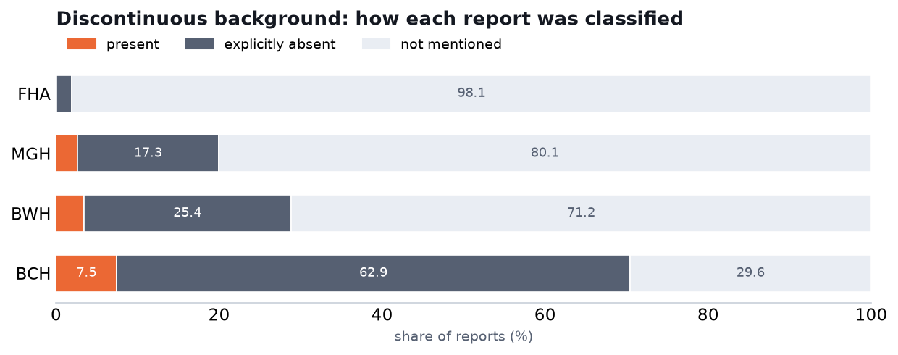

# Discontinuous background — labeling clinical EEG reports

We labeled every report for whether it explicitly calls the EEG background **discontinuous**. Each
report gets one of three calls: the report says it is (`present`), the report says it isn't —
i.e. calls the background continuous (`explicitly_absent`), or the report doesn't address
continuity at all (`not_mentioned`). The prompt is the one Vasily suggested, used verbatim, with
the model constrained (GBNF grammar) so the answer is always exactly one of those three tokens.
Model is MedGemma-27B (Q4_K_S), temperature 0.

It ran on Fraser Health (45,545 reports) and on three Harvard hospitals — MGH, BWH, BCH
(~100,600 reports; BIDMC has no report text). About 1.3% of Harvard reports are longer than the
context window and returned nothing; they are left out of the counts below.

## Is there a matching Harvard variable?

No. The Harvard database has no "discontinuous" finding column. The nearest is `low voltage`, which
is a different thing (amplitude, not continuity), so we do not compare against it. This field is
therefore our labels only — no head-to-head with Harvard. How Harvard codes the columns it *does*
have is written up in the companion note `reports/harvard_llm_labeling.md`.

## What we found



| dataset | present | explicitly absent (continuous) | not mentioned | reports |
|---|---|---|---|---|
| Fraser Health | 0.1% | 1.8% | 98.1% | 45,545 |
| MGH | 2.6% | 17.3% | 80.1% | 54,844 |
| BWH | 3.4% | 25.4% | 71.2% | 20,705 |
| BCH | 7.5% | 62.9% | 29.6% | 25,022 |

Discontinuity itself is uncommon everywhere, which is expected — it's an ICU / deep-sedation
finding, not something a routine EEG shows. The present rate runs from near-zero on Fraser Health
up to 7.5% at BCH (a children's hospital, more ICU EEG).

The bigger difference between the cohorts is not how often the background *is* discontinuous, but
how often the report **comments on continuity at all**. Fraser Health reports almost never do:
98% don't mention it. The Harvard reports discuss it constantly, and usually to say the background
is continuous — explicit "continuous / not discontinuous" statements reach 17% at MGH, 25% at BWH
and 63% at BCH. That is a difference in reporting style, not a disagreement about any one
recording: Harvard's ICU/EMU reports routinely state whether the background is continuous, and
Fraser Health's routine reports simply don't raise the question.

So the numbers to read here are the present rates. The large `explicitly_absent` column on the
Harvard side is just those cohorts writing "continuous" out loud.

## Caveats

- No Harvard column to check against, so this is our own labeling with no external reference.
- About 1.3% of Harvard reports were too long for the context window and returned no label; they
  are excluded.
- "Discontinuous" was kept strictly separate from burst-suppression and suppressed background, per
  the prompt — those are labeled on their own and are not folded in here.

## Reproduce

```bash
# labeling (on the cluster)
bash slurm/submit_background.sh            # Fraser Health, all background fields
bash slurm/submit_background_harvard.sh    # MGH / BWH / BCH
# distribution + chart
python -m analysis.background_dist                 # results/background/dist_summary.json
python -m analysis.background_field_charts         # figures/dist_discontinuous.png
```

Labeler and prompt: `src/cpu/background.py` (field `discontinuous`). Companion note on the Harvard
fields: `reports/harvard_llm_labeling.md`.
