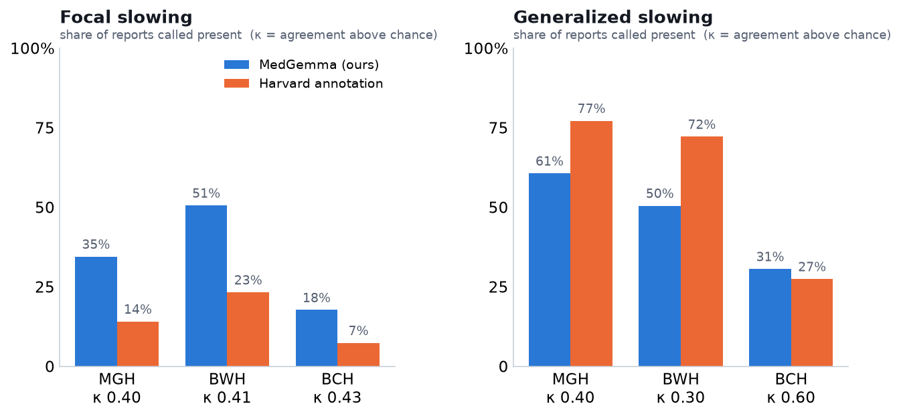
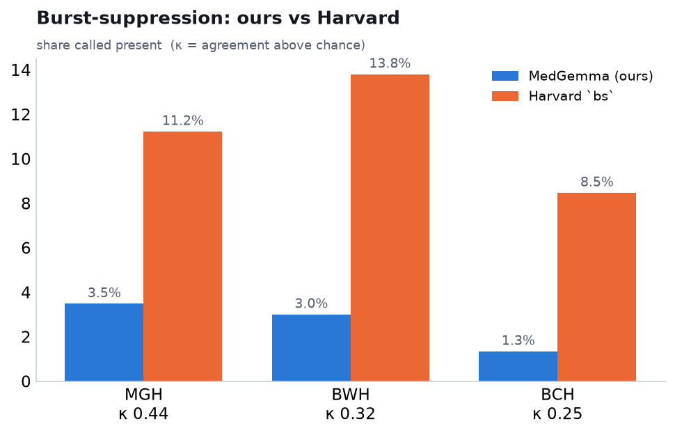
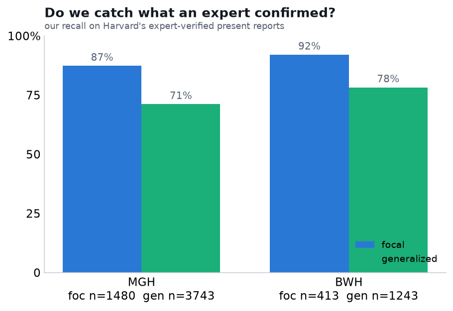
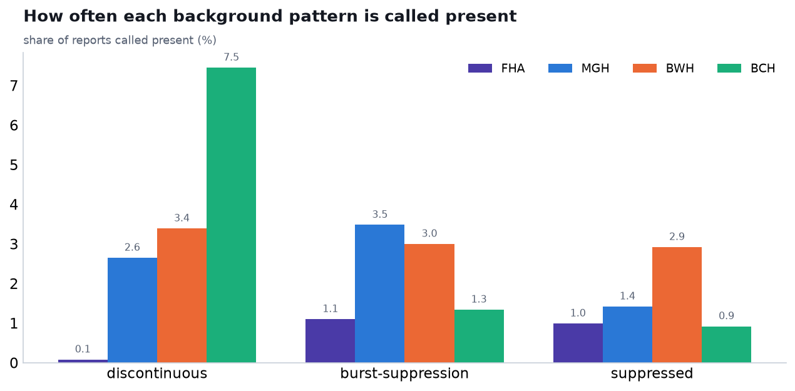

# EEG report labeling with MedGemma — five findings, and how they compare to Harvard

This pulls together everything we've labeled so far: two slowing findings (focal, generalized) and
three background patterns (discontinuous, burst-suppression, suppressed). Each is a separate field
with a three-way call — the report says it's there (`present`), says it isn't
(`explicitly_absent`), or doesn't bring it up (`not_mentioned`). Everything ran on Fraser Health
(45,545 reports) and three Harvard hospitals — MGH, BWH, BCH (~101,600; BIDMC has no text) — with
MedGemma-27B (Q4_K_S), temperature 0, grammar-constrained so every answer is one clean status.

Three of the five findings have a matching column in the Harvard database and can be compared
head-to-head: focal slowing (`foc slowing`), generalized slowing (`gen slowing`), and
burst-suppression (`bs`). Discontinuous and suppressed background have no Harvard variable, so for
those we only have our own labels.

## The comparison, in one table

Harvard's value is present-or-blank and carries a *provenance* (was the finding taken from the
report text, from the recording's annotations, or expert-verified). We compare three ways: against
everything they marked, against only what they took from the report text (the fair like-for-like,
since we read only the text), and — the closest thing to a right answer — our recall on the
findings an expert had verified. How their values are coded is spelled out in the companion note
`reports/harvard_llm_labeling.md`.

| field — hospital | ours present | Harvard present | agreement | κ | κ text-only | our recall on verified |
|---|---|---|---|---|---|---|
| focal slowing — MGH | 34.5% | 14.1% | 77% | 0.40 | 0.37 | 87% (1480) |
| focal slowing — BWH | 50.6% | 23.3% | 70% | 0.41 | 0.39 | 92% (413) |
| focal slowing — BCH | 17.7% | 7.4% | 87% | 0.43 | 0.42 | — |
| generalized slowing — MGH | 60.6% | 77.2% | 74% | 0.40 | 0.47 | 71% (3743) |
| generalized slowing — BWH | 50.5% | 72.2% | 65% | 0.30 | 0.37 | 78% (1243) |
| generalized slowing — BCH | 30.6% | 27.4% | 84% | 0.60 | 0.66 | — |
| burst-suppression — MGH | 3.5% | 11.2% | 92% | 0.44 | 0.60 | 65% (231) |
| burst-suppression — BWH | 3.0% | 13.8% | 89% | 0.32 | 0.50 | 61% (184) |
| burst-suppression — BCH | 1.3% | 8.5% | 93% | 0.25 | 0.29 | — |

Reading it: *agreement* is how often both sides give the same present/not call; *κ* is that
agreement after removing what chance alone would give (0 = chance, 1 = perfect). κ around 0.3–0.6
is moderate. *κ text-only* compares against just the labels Harvard took from the report text.
*Recall on verified* is how often we catch the findings an expert confirmed (positives only; BCH
has none).

The patterns are consistent and mostly explainable:

- **Focal slowing — we call it more than they do** (about 2×), yet on the expert-verified cases we
  catch ~87–92%. So the extra is largely real findings the model reads out of the text.
- **Generalized slowing — they call it more than we do**, and we miss ~1 in 4 verified cases, so
  our under-calling is partly genuine. Comparing text-to-text lifts κ (their annotation-only labels
  aren't in the narrative).
- **Burst-suppression — their `bs` is marked 3–6× more than ours**, at MGH/BWH almost entirely
  through their annotation channel: text-to-text κ jumps to 0.50–0.60 there. Reading only the
  report, we agree well with what the *report* says; we just don't see the annotation-only flags.
  BCH is the exception — there their `bs` is itself mostly from the text, so the gap is a genuine
  under-call on our side, not an annotation artifact (text-only κ stays low, 0.29).

## Charts









## Fraser Health

Fraser Health has no labels of its own for any of these, so here we just have what the model found:

| field | present | explicitly_absent | not_mentioned |
|---|---|---|---|
| focal slowing | 25.6% | 24.5% | 50.0% |
| generalized slowing | 23.0% | 40.2% | 36.8% |
| discontinuous | 0.1% | 1.8% | 98.1% |
| burst-suppression | 1.1% | 0.1% | 98.8% |
| suppressed | 1.0% | 1.7% | 97.4% |

The background patterns are rare, as expected for ICU / anesthesia findings. Discontinuous stands
out: Fraser Health reports almost never comment on continuity (0.1% present, 98% not mentioned),
whereas the Harvard reports do so often — at BCH, 63% of reports explicitly call the background
continuous. That's a difference in how the two cohorts write reports, not a disagreement about any
one recording.

## Discontinuous and suppressed background

Neither has a Harvard column to check against (the nearest, `low voltage`, is a different thing),
so these stay labels-only. Present rates are low throughout — discontinuous 2.6–7.5% across the
Harvard hospitals, suppressed 0.9–2.9%.

## Caveats

- About 1.3–1.4% of Harvard reports are too long for the context window and returned no label;
  they're excluded from the counts.
- Harvard's column is present-or-blank; a blank mixes "the report says absent" with "not
  mentioned" and "not annotated". We keep those apart on our side but collapse to present-vs-not to
  compare.
- The verified check is positives-only (no verified "absent") and has no BCH data, so it measures
  recall, not precision. A small hand-labeled set with negatives would let us score both models
  fully — including Fraser Health, which has no ground truth today.

## Reproduce

```bash
# labeling (on the cluster)
bash slurm/submit_slowing.sh ; bash slurm/submit_slowing_harvard.sh
bash slurm/submit_background.sh ; bash slurm/submit_background_harvard.sh
# comparisons, distributions, charts, table
python -m analysis.slowing_vs_harvard
python -m analysis.background_vs_harvard
python -m analysis.background_dist
python -m analysis.slowing_chart ; python -m analysis.background_chart
python -m analysis.master_table
```

Companion notes: `reports/harvard_llm_labeling.md` (how Harvard's fields and values are coded),
`reports/slowing_vs_harvard.md` and `reports/background_patterns.md` (the per-topic write-ups).
