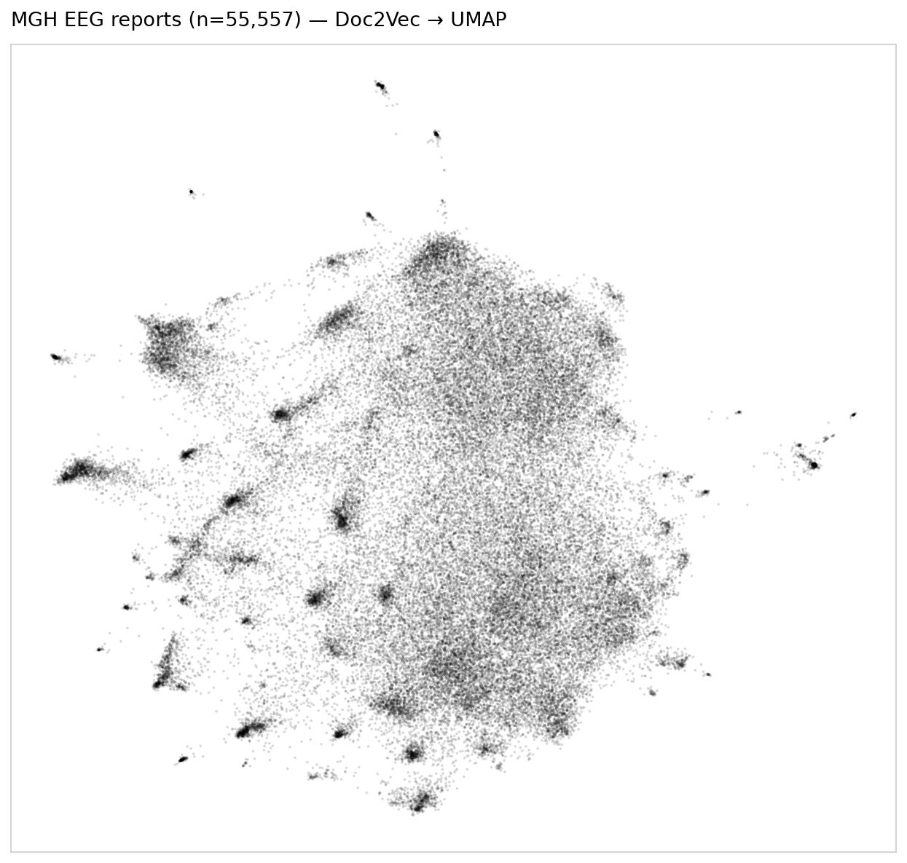
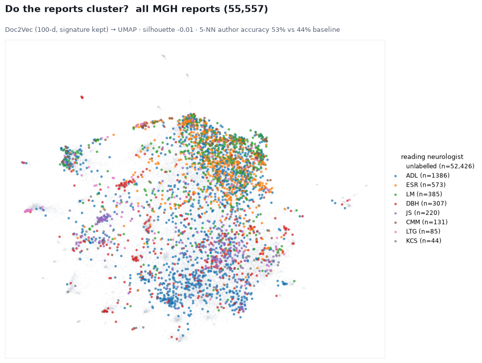

# Grouping the Harvard EEG reports with doc2vec

We wanted to see whether the MGH EEG reports fall into natural groups, and in particular whether
reports written by the same neurologist end up near each other. This is the doc2vec idea from
Alexander's Fraser Health code, run on the Harvard reports.

Each of the 55,557 MGH reports was turned into a 100-dimensional vector with doc2vec (the same
settings as Alexander's — window 5, 100 epochs, min_count 3, PV-DM) and then projected down to
two dimensions with UMAP. Where the de-identification happened to leave a reader's initials in
the signature line, we tagged the report with that neurologist; that gave us eight neurologists
with at least forty reports each. We tried it both ways: with the signature cut out, so only the
writing itself counts, and with it left in.

Plotted plain, the reports look like this:



One big loose cloud with a scatter of small, tight knots around it. Those knots turn out to be
near-identical templated reports — the standard "Normal EEG" text and the like — not anything to
do with who wrote them.

Coloring the eight neurologists on the same map:



The colors are spread right through the cloud. A couple of readers lean to one side (ESR a bit
higher, ADL a bit lower), but nobody forms their own group. The numbers agree: however we
measure it, telling the neurologist from the report is barely better than guessing the most
common one — about 47–53% against a 44% baseline, and a silhouette score near zero. Clustering
the whole map lumps 86% of the reports into a single group.

So with doc2vec the reports don't sort by neurologist, with or without the signature in the text.
The grouping that is there is about the report template, not the person — most likely because
these reports are so templated that the shared boilerplate, which doc2vec averages over the whole
document, drowns out any individual style. If we want to keep after the "who wrote it" question,
the next thing worth trying is character n-grams after stripping out the boilerplate.

To reproduce:

```bash
python -m analysis.harvard_doc2vec_authors                 # signature removed
STRIP_SIG=0 python -m analysis.harvard_doc2vec_authors     # signature kept
```
