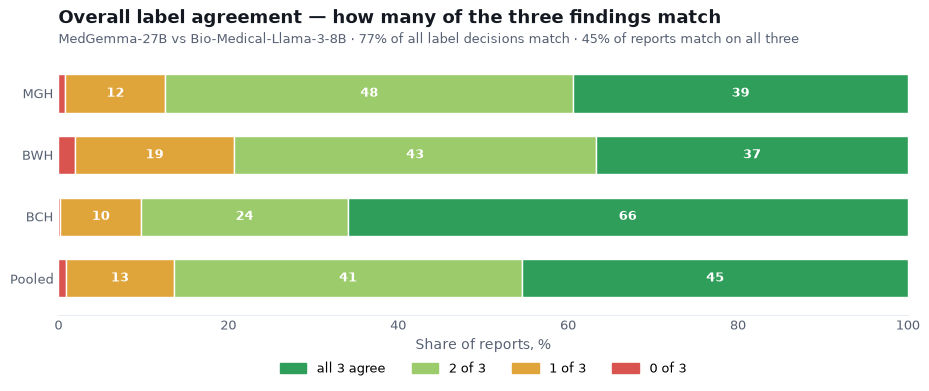
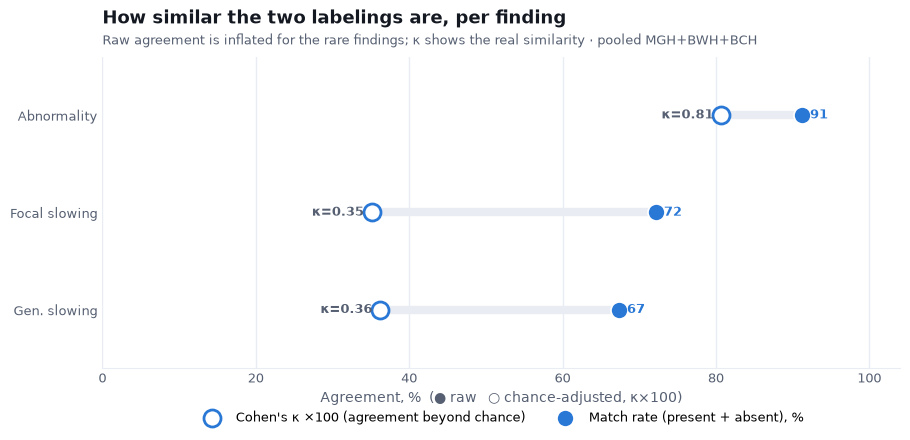
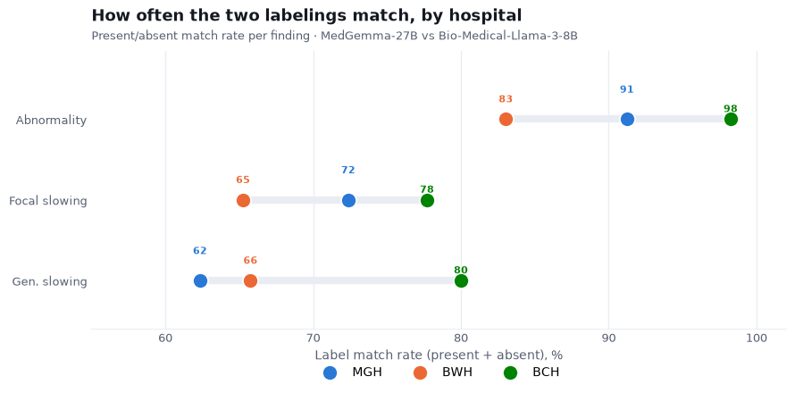
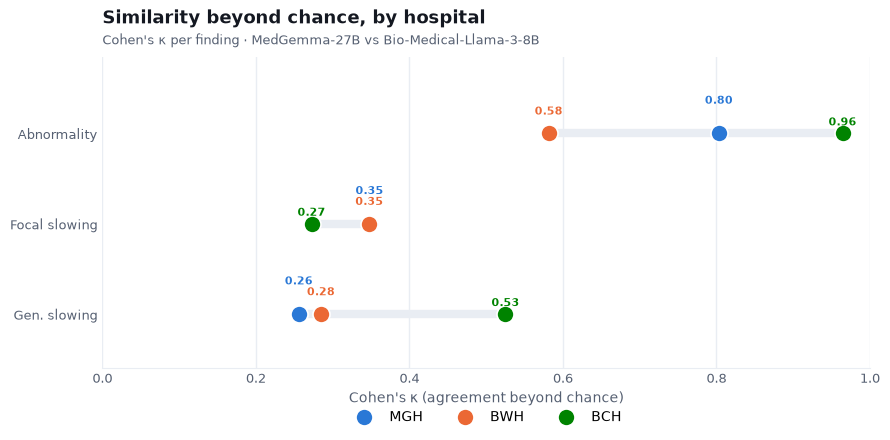
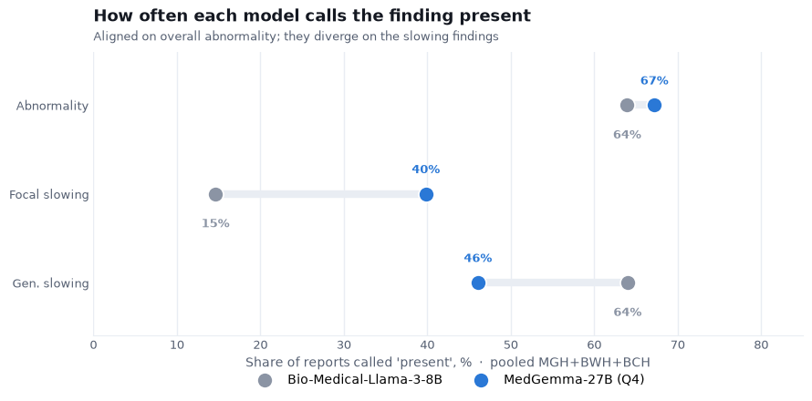

# MedGemma-27B vs Bio-Medical-Llama-3-8B — the same EEG reports, two labelings

We labeled Harvard's clinical EEG reports — **101,614 reports across three hospitals** — with
**MedGemma-27B** (prompt v5g, Q4) and compared the result against Harvard's own
**Bio-Medical-Llama-3-8B** labels for the same reports. There is no human ground truth here,
so this is a **similarity comparison between two independent language models**, not an
accuracy one. It is a stress test of generalization: does a model built and tuned on our own
reports line up with a different model, from a different group, on reports from a hospital
system it has never seen?

We compare the three findings that map cleanly between the two schemas:

| MedGemma | Bio-Medical-Llama |
|---|---|
| overall Abnormality | `abnormal` |
| Focal non-epileptiform | `foc slowing` |
| Generalized non-epileptiform | `gen slowing` |

We report **two numbers per finding: raw present/absent agreement and Cohen's κ** (agreement
beyond chance). Kappa matters because raw agreement is inflated for the rare findings, where
both models say the finding is absent most of the time, so a high raw number can hide a low
real similarity. BIDMC (Beth Israel) is left out: its report text is not in the shared data.

## Overall — how much the labels coincide



Across all findings, **77% of individual label decisions match** between the two models.
Counting whole reports, **45% agree on all three findings**, another 41% on two of three, and
only ~1% on none. The pediatric hospital (BCH) is the closest match.

## Per finding — how similar the two really are



| Finding | MGH agree / κ | BWH agree / κ | BCH agree / κ | Pooled agree / κ |
|---|---|---|---|---|
| Abnormality | 91% / 0.80 | 83% / 0.58 | 98% / 0.96 | **91% / 0.81** |
| Focal slowing | 72% / 0.35 | 65% / 0.35 | 78% / 0.27 | **72% / 0.35** |
| Gen. slowing | 62% / 0.26 | 66% / 0.28 | 80% / 0.53 | **67% / 0.36** |

The **overall abnormal-or-normal call is strongly shared — κ = 0.81** (and 0.96 at BCH). On a
hospital system neither model was built for, the two independently agree on whether an EEG is
abnormal, well beyond chance.

The **slowing findings look agreed on the raw number (67–72%), but κ is only 0.35–0.36** —
fair agreement. Most of that raw 70% is just both models agreeing the finding is absent; on
the reports that actually mention slowing, the two often disagree.

## By hospital — match rate and κ

Two views side by side. **Match rate** counts every report where the two models make the same
present/absent call; **κ** discounts the easy both-absent agreement and shows the real
similarity.





On the raw match rate everything looks 62–98% similar. But κ separates it: abnormality is a
real match (κ = 0.96 at BCH, 0.80 at MGH, 0.58 at BWH — at BWH the two call abnormality at
somewhat different rates), while the slowing findings are only fair everywhere (κ = 0.26–0.53)
— most of their 62–80% match rate is just both models agreeing that the finding is absent.

## Where they diverge — the call rate



How often each model marks the finding present (pooled):

| Finding | MedGemma-27B (Q4) | Bio-Medical-Llama-3-8B |
|---|---|---|
| Abnormality | 67% | 64% |
| Focal slowing | 40% | 15% |
| Gen. slowing | 46% | 64% |

On overall abnormality the two call it at nearly the same rate (67% vs 64%). The slowing
findings split, and in **opposite directions**: MedGemma marks **focal slowing about three
times as often** (40% vs 15%), while Bio-Medical-Llama marks **generalized slowing more** (64%
vs 46%). The two models simply divide slowing between focal and generalized differently.

## What this means

- **The main result is the abnormality agreement (κ = 0.81).** Two independently built models,
  on an unseen hospital's reports, agree on the overall call well beyond chance — good evidence
  that the labeling generalizes past the reports it was tuned on.
- **The slowing divergence is most likely definitional, not a plain error.** With no human
  label, neither model is definitively correct here, and the two disagree in *opposite*
  directions on focal vs generalized, which points to the two schemas drawing the
  focal/generalized line for slowing differently. Bio-Medical-Llama's labels are also part rule-based and curated, marked
  present mainly when a finding is stated explicitly, whereas MedGemma infers from the
  narrative — which would push it to call more where the wording is suggestive.

## Caveats

- **Similarity, not accuracy.** No human ground truth for these reports, so where the two
  differ neither can be called correct.
- Only the three cleanly-mappable findings are compared. Epileptiform is split differently on
  the two sides (Bio-Medical-Llama does not separate spikes/seizures into focal vs generalized)
  and is left for a separate look.
- **BIDMC excluded** — report text unavailable.

## Reproduce

```bash
python -m analysis.harvard_compare      # the tables above + all four figures
```

MedGemma labels: `results/harvard/labels/*/` (produced by `slurm/label_harvard.sbatch` via
`slurm/submit_harvard.sh`, reading the report text from the HEEDB zips through
`analysis/harvard_index.py`). Bio-Medical-Llama labels: the `*_EEG_with_reports` tables in
`HarvardEEG.db`.

---

*Pipeline, prompts, and the scripts behind this report:*
**https://github.com/vbronetskyi/eeg-report-classification**
