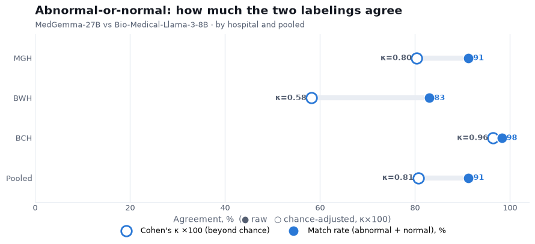
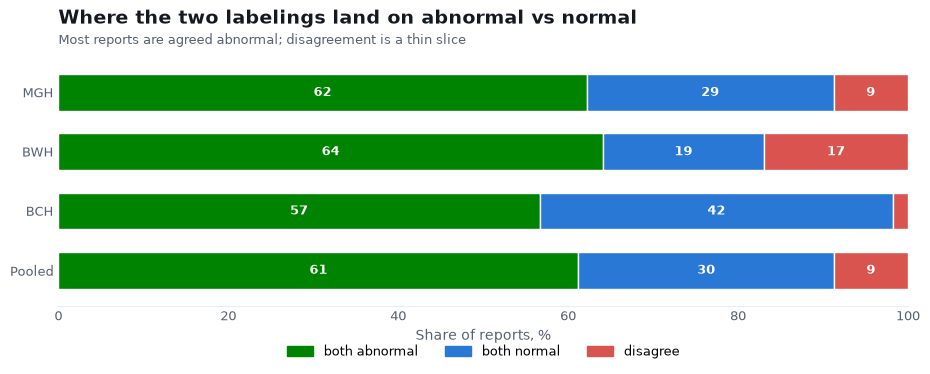
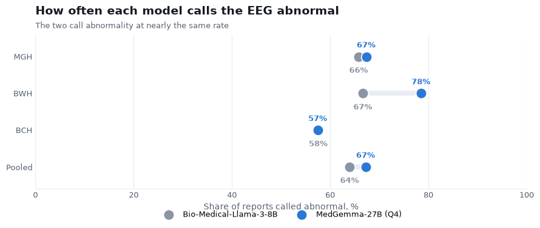

# MedGemma-27B vs Bio-Medical-Llama-3-8B — the abnormal-or-normal call

We labeled Harvard's clinical EEG reports, 101,614 across three hospitals, with MedGemma-27B
(prompt v5g, Q4) and compared the result against Harvard's own Bio-Medical-Llama-3-8B labels for
the same reports. There is no human ground truth here, so this is a similarity comparison
between two independent language models, not an accuracy one, and a test of how well a model
built on our own reports lines up with a different model on a hospital system it has never seen.

This report looks at one finding only: whether the EEG is abnormal or normal. We keep to that
finding because it maps cleanly between the two schemas. The slowing findings do not: our focal
and generalized non-epileptiform categories bundle slowing together with attenuation,
asymmetry, disorganization, encephalopathy, and excessive beta, whereas the Harvard schema files
each of those under its own separate column. So a direct focal-slowing or generalized-slowing
comparison would be measuring two different things, and we leave it out here (the check behind
that is in `analysis/mapping_check.py`). The abnormal-or-normal call has no such problem.

We report two numbers: the match rate, the share of reports where the two models make the same
abnormal/normal call, and Cohen's κ, which discounts the agreement you would expect by chance.

## How much the two agree



| Hospital | Reports | Match rate | Cohen's κ | MedGemma abnormal | Bio-Medical-Llama abnormal |
|---|---|---|---|---|---|
| MGH | 55,557 | 91% | 0.80 | 67% | 66% |
| BWH | 21,035 | 83% | 0.58 | 78% | 67% |
| BCH | 25,022 | 98% | 0.96 | 57% | 58% |
| **Pooled** | **101,614** | **91%** | **0.81** | **67%** | **64%** |

Pooled across the three hospitals the two models make the same call on **91% of reports, with
κ = 0.81** — strong agreement well beyond chance. Two models built by different groups, on
reports neither was tuned for, land on the same abnormal-or-normal verdict nine times in ten.
The pediatric hospital, BCH, is almost a lock-step match (98%, κ = 0.96). BWH is the loosest
(κ = 0.58): there MedGemma calls abnormal noticeably more often than Bio-Medical-Llama (78% vs
67%), so the two part ways on more reports.

## Where the reports land



Splitting every report three ways: pooled, **61% are agreed abnormal, 30% agreed normal, and
only 9% are a disagreement**. Most EEGs in this corpus are abnormal and both models see that;
the genuine split is a thin slice, widest at BWH (17%) and almost nothing at BCH (about 1%).

## How often each model calls abnormal



The two mark abnormality at nearly the same rate overall (MedGemma 67%, Bio-Medical-Llama 64%),
and very close at MGH and BCH. BWH is the one place they diverge, with MedGemma reading more of
those reports as abnormal. That gap is what pulls BWH's κ down while the raw match rate still
looks high.

## What this means

The overall abnormal-or-normal call is the finding that carries between the two labelings.
κ = 0.81 pooled, and 0.96 at BCH, is good evidence that this part of the labeling generalizes
past the reports it was built on: an unseen hospital system, a different model, and the two
still agree on the headline call. The one soft spot is BWH, where MedGemma leans abnormal more
than Bio-Medical-Llama does; since there is no ground truth, we cannot say which is closer to
right there.

## Caveats

- Similarity, not accuracy. There is no human label for these reports, so where the two differ
  neither can be called correct.
- One finding only. The slowing findings are left out because the two schemas define
  non-epileptiform activity differently, not because the models were checked and disagreed.
- BIDMC (Beth Israel) is excluded — its report text is not in the shared data.

## Reproduce

```bash
python -m analysis.harvard_abnormality      # the table above and the three figures
python -m analysis.mapping_check            # why the slowing findings are left out
```

MedGemma labels: `results/harvard/labels/*/` (produced by `slurm/label_harvard.sbatch` via
`slurm/submit_harvard.sh`, reading the report text from the HEEDB zips through
`analysis/harvard_index.py`). Bio-Medical-Llama labels: the `*_EEG_with_reports` tables in
`HarvardEEG.db`.

---

*Pipeline, prompts, and the scripts behind this report:*
**https://github.com/vbronetskyi/eeg-report-classification**
