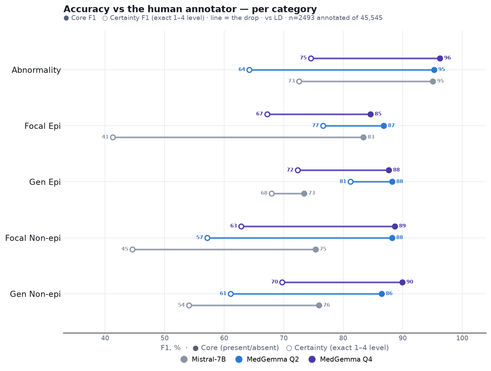
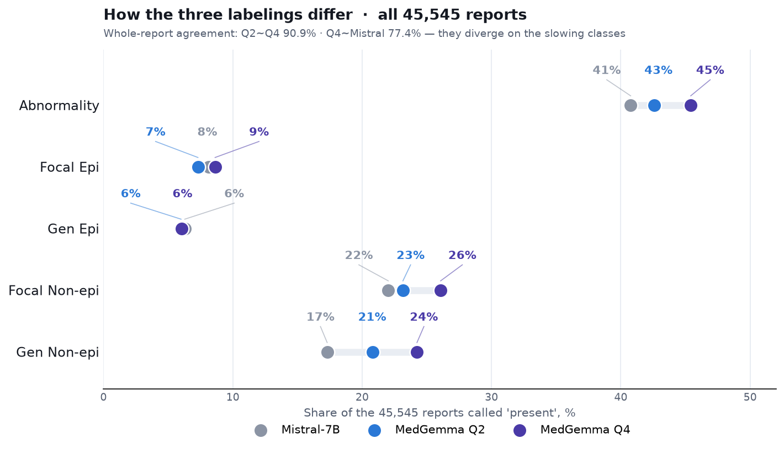
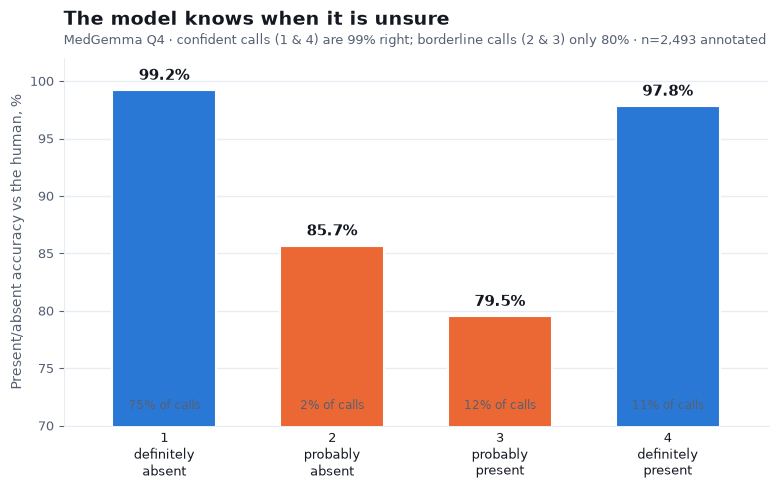
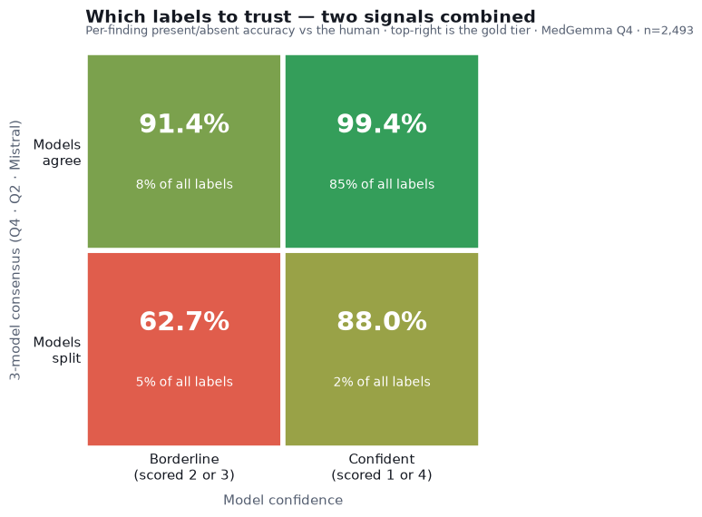

# Labeling the 45k dataset — MedGemma vs Mistral

We ran our EEG-report classifier over the whole `processed_reports` set (45,545 reports)
and compared it against the Mistral-7B labels that already ship with the project. Both
models label the same reports, so we can see where they disagree; and on the ~2,500 reports
that also have a human label, we can check which model comes closer to the human.

Our model is MedGemma-27B with the v5 prompt and the consistency grammar (v5g), run at the
Q4 quantization. We used Q4 because it holds up best on reports unlike the ones we tuned on,
and this set is exactly that case: hospitals and physicians the model has not seen before.

**What the labels are.** Each report gets five findings — overall abnormality, focal and
generalized epileptiform activity, focal and generalized non-epileptiform (slowing) — and
each is scored 1 to 4. Everywhere in this report, **"present" means the finding was scored 3
or 4** (the model thinks it is there); a score of 1 or 2 means absent. All the percentages
below are built on that present/absent call.

## Accuracy against the human annotator

2,493 of the reports were also labeled by our reference annotator, LD — the same person
whose labels we used for all the benchmarking. On those reports we can score each model
against the human.

*How to read the numbers: each value in the table is an F1 score for one finding — how well
the model's "present" calls line up with the human's, balancing missed findings against
false alarms, where 100 is perfect. "Whole report" is the share of the 2,493 reports where
the model got all five present/absent calls right.*

| Category | MedGemma Q4 | MedGemma Q2 | Mistral |
|---|---|---|---|
| Abnormality | 96.2 | 95.3 | 95.1 |
| Focal Epi | 84.6 | 86.8 | 83.4 |
| Gen Epi | 87.7 | 88.2 | 73.4 |
| Focal Non-epi | 88.7 | 88.2 | 75.3 |
| Gen Non-epi | 89.9 | 86.4 | 75.9 |
| **Whole report** | **87.5%** | **87.1%** | **75.0%** |

Both models get the easy overall abnormal-or-normal call about right (~95). The gap opens up
on the harder findings: for generalized epileptiform and the two slowing findings, our model
is 13 to 14 points above Mistral; on focal epileptiform the two are about even. Those harder
findings are also where the models disagree on the full set (next section), so the
disagreements are mostly Mistral missing things.

In the chart, each model is a pair of dots per finding. The filled dot is the present/absent
score above; the open dot is a stricter version that also requires the exact 1–4 confidence
level to match, and the line is the drop between them. That stricter score is where Mistral
falls apart — on focal epileptiform its confidence agreement drops to 41, while ours stays
in the 70s.

## Where the two models disagree (all 45,545)

Here there is no human label. We are just looking at how often each model calls each finding,
and how often the two make the same call.

*How to read it: the "present" columns are the share of all 45,545 reports where that model
scored the finding 3 or 4. "Agreement" is the share of reports where the two models made the
same present/absent call for that finding. The whole-report figure is the share where all
five calls match.*

| Category | MedGemma Q4 "present" | Mistral "present" | Agreement |
|---|---|---|---|
| Abnormality | 45.4% | 40.8% | 93.3% |
| Focal Epi | 8.6% | 8.1% | 98.0% |
| Gen Epi | 6.0% | 6.3% | 98.3% |
| Focal Non-epi | 26.1% | 22.0% | 88.9% |
| Gen Non-epi | 24.2% | 17.3% | 89.6% |

The two models make the same call on all five findings in **77.4%** of reports. They line up
almost perfectly on the rare epileptiform findings and split on the slowing findings, where
our model (especially Q4) flags more. Since that is also where our model is closer to the
human, the extra flags are mostly real findings Mistral left out. The roughly one report in
four where the two disagree is a good shortlist for a person to spot-check.

## Does the model size matter? (Q2 vs Q4)

We labeled everything with the smaller Q2 model as well (~10 GB against ~15 GB). The two
agree on 90.9% of reports, and where they split it is again the slowing findings.

*Same reading as above: "present" columns are the share of the 45,545 each model scores 3 or
4; the last column is how often the two quantizations make the same present/absent call.*

| Category | Q2 "present" | Q4 "present" | Q2 vs Q4 agreement |
|---|---|---|---|
| Abnormality | 42.6% | 45.4% | 96.6% |
| Focal Epi | 7.3% | 8.6% | 98.6% |
| Gen Epi | 6.0% | 6.0% | 99.1% |
| Focal Non-epi | 23.2% | 26.1% | 96.1% |
| Gen Non-epi | 20.8% | 24.2% | 95.8% |

On the epileptiform findings the two are interchangeable (agreement above 98%). Q4 calls
abnormality and slowing a little more often, and against the human that helps a bit — 87.5%
whole-report against 87.1%, mostly from generalized slowing (89.9 against 86.4). That is the
small gain on unfamiliar reports we expected from Q4, so Q4 is the labeling we are using and
Q2 stays as a second opinion.

---

*Pipeline, prompts, and the scripts behind this report:*
**https://github.com/vbronetskyi/eeg-report-classification**

## How much to trust each label

Not every label is equally reliable, and the model gives us two independent ways to tell
which ones to trust — neither of which needs a human to check.

The first is the model's own confidence. Each finding is scored 1 to 4; a 1 or 4 is a
confident call, a 2 or 3 is borderline. On the annotated reports, confident calls are right
99% of the time and borderline calls only 80%. Nearly all the errors sit in the borderline
scores, which the model flags itself.

The second is agreement between the models. When Q4, Q2 and Mistral all make the same
present/absent call, that call matches the human 96% of the time; when they split, only 65%.
Across the whole set, 75% of reports are unanimous.

The two signals are independent, so putting them together sorts the labels cleanly:

The gold tier — confident *and* unanimous — is 99.4% correct and already covers 85% of all
label decisions. At the level of whole reports, 60% of the 45k are gold (all five findings
confident and unanimous) and come out 98.4% correct, while about 18% fall in the review tier
at 55%. So most of the set can be used as it is, and a reviewer's time goes to the ~18% that
actually needs it.
