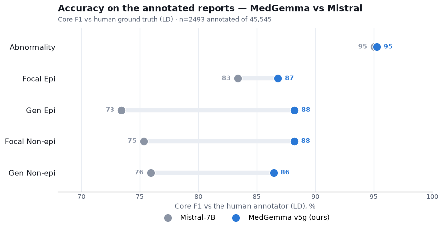

# Labeling the 45k dataset — MedGemma vs Mistral

We labelled the full **45,545-report** clinical EEG dataset (`processed_reports`) with our
best pipeline, **MedGemma-27B v5g** (prompt v5 + grammar-enforced consistency, Q2_K,
temperature 0). The paper's **Mistral-7B** pipeline had already labelled the **same 45,545
reports** (released in the project database), so we have **two independent labelings of the
whole set** and can compare them directly — and, on the reports that also carry human
ground truth, see which labeler is more accurate.

> **Bottom line:** the two models **agree on ~79% of reports** (all five present/absent
> calls) and 90–98% per category. Where they disagree it is mostly the *slowing* classes —
> and there **MedGemma is the more reliable one**: on the 2,493 reports with human labels,
> MedGemma matches the annotator **87.1%** of the time vs Mistral's **75.0%**.

## How much the two labelings agree (all 45,545)

| Category | MedGemma "present" | Mistral "present" | Agreement |
|---|---|---|---|
| Abnormality | 42.6% | 40.8% | 93.4% |
| Focal Epi | 7.3% | 8.1% | 98.2% |
| Gen Epi | 6.0% | 6.3% | 98.0% |
| Focal Non-epi | 23.2% | 22.0% | 89.9% |
| Gen Non-epi | 20.8% | 17.3% | 91.2% |

**Whole-report agreement (present/absent, all 5): 79.1%.** On the exact 1–4 confidence
level the two agree only 42.6% — expected, since the models express confidence differently
(Mistral's certainty calibration is the weaker part of that pipeline).

**Where they differ:** almost entirely the **non-epileptiform (slowing)** classes. The two
are near-identical on the rare epileptiform findings (98% agreement) but MedGemma flags
**Gen Non-epi** noticeably more often (20.8% vs 17.3%) — the diffuse-slowing / encephalopathy
class that Mistral tends to under-call.

## Which one is right? (accuracy vs the human annotator)

2,493 of the 45,545 reports also have human ground truth (annotator LD, from the Zoe/Maria
annotation sets). On those we can score both labelings against the human:



| Category | MedGemma | Mistral |
|---|---|---|
| Abnormality | 95.3 | 95.1 |
| Focal Epi | 86.8 | 83.4 |
| Gen Epi | 88.2 | 73.4 |
| Focal Non-epi | 88.2 | 75.3 |
| Gen Non-epi | 86.4 | 75.9 |
| **Whole report** | **87.1%** | **75.0%** |

*(Core F1 vs LD; whole report = share with all five present/absent calls correct.)*

The two are tied on the easy overall abnormal/normal call (95 vs 95), but on every harder
class **MedGemma is well ahead** — decisively on **Gen Epi (88 vs 73)**, **Focal Non-epi
(88 vs 75)** and **Gen Non-epi (86 vs 76)**. This is exactly where the two labelings
disagreed on the full set — so the disagreements resolve in MedGemma's favour.

## Takeaways

- **Ship the MedGemma labeling** as the primary one for the 45k set — it agrees with the
  human annotator 12 points more often than Mistral (87% vs 75%), driven by the harder
  slowing/generalized classes.
- **Mistral is a useful independent cross-check.** The ~21% of reports where the two
  disagree — concentrated in the slowing classes — are a natural shortlist for human
  spot-review.
- **Confidence levels are not comparable across the two** (42.6% exact agreement); if the
  downstream use needs the 1–4 level, use MedGemma's (its certainty was validated far
  closer to the human than Mistral's).

## Reproduce

```bash
python -m analysis.labels_vs_mistral      # tables above + the chart
```
MedGemma labels: `results/labels/*.json` (produced by `slurm/label_reports.sbatch`, one
JSON per 2,000-report chunk). Mistral labels: the released `classifications` table. Human
ground truth: the Zoe/Maria LD annotation databases. Labels store only the five scores and
confidences per hashed report id — never the report text.
