# Comparing prompt variants for EEG report classification

We evaluated **four prompt variants** for MedGemma-27B, each on both datasets and
both quantizations (**4 prompts × 2 datasets × 2 quants = 16 runs**; all numbers are
pooled over **1994 reports** — 1495 Zoe + 499 Maria — scored against annotator LD).
The baseline model already matched the paper's Mistral-7B everywhere except one
class; these prompts are the attempt to close that gap.

| Prompt | What it is |
|---|---|
| **v1** | Original baseline — Impression-first, short definitions. |
| **v2** | Professor's revision — neurologist system role, read the report *body* first, keep body findings even when the Impression is conservative, extended clinical definitions. |
| **v3** | Ours — v1 + explicit **Focal-Epi exclusions** (don't count generalized discharges, benign variants, artifacts, or focal slowing as focal epileptiform). |
| **v4** | Ours — v1 + a **structured procedure** (detect epileptiform → localize focal vs generalized → assign). |

> **Bottom line:** **v3 is the best variant** (1679 / 1994 reports fully correct). It
> fixes the one weak class — **Focal Epi 0.80 → 0.83, matching Mistral-7B** and beating
> it on Maria (0.90 vs 0.81) — without hurting the rest. v2 (the professor's) is the
> weakest overall because it pushes Focal Epi the wrong way.

**Why v3 wins:** it starts from v1 (already our strongest baseline — 4 of 5 categories
at or above Mistral) and changes exactly one thing — explicit exclusions for the one
weak class, Focal Epi. That single, targeted fix lifts Focal Epi (0.80 → 0.83, via
higher precision) and even nudges Gen Non-epi up, while leaving the other categories
essentially untouched — so it keeps every strength and repairs the only weakness,
for a net +7 fully-correct over v1. v4 targets the same class with a step-by-step
procedure but the plain exclusion list works slightly better; v2 pushed the opposite
way and broke Focal Epi.

---

## 1. Overall — which prompt is best

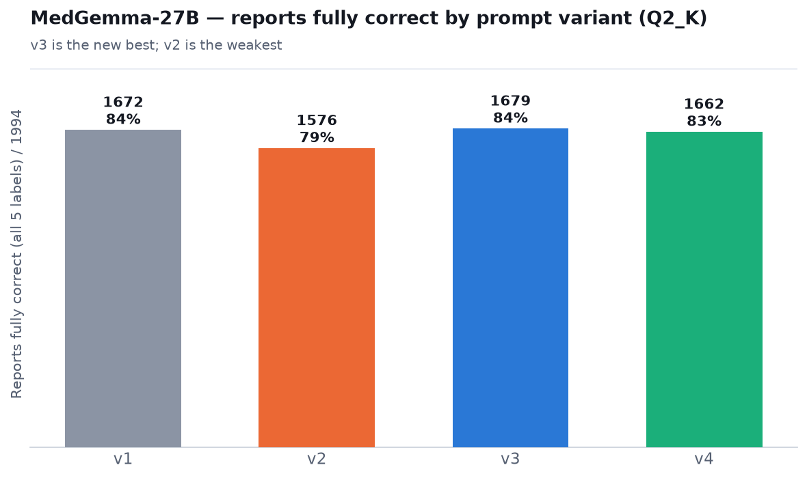

**What you see:** reports where all five labels are correct. v3 (1679) edges out the
v1 baseline (1672); v4 is close (1662); **v2 is clearly weakest (1576)**. The spread
is small because four of five categories barely move between prompts — the real
differences are in one place (next chart).

## 2. Where the variants actually differ

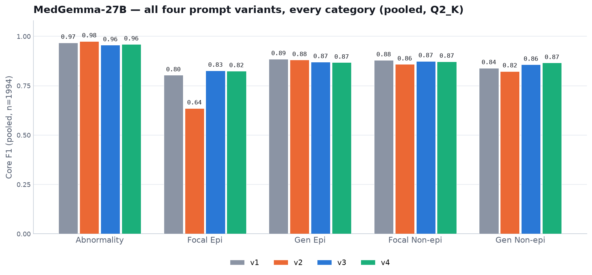

**What you see:** on **Abnormality, Gen Epi, Focal Non-epi** all four prompts are
within a point or two — the prompt hardly matters there. The one category that
separates them is **Focal Epi**: v2 collapses (0.64), the baseline v1 sits at 0.80,
and our **v3/v4 lift it to 0.83/0.82**. v3/v4 also nudge **Gen Non-epi** up
(0.84 → 0.86–0.87).

---

## 3. The target — Focal Epi

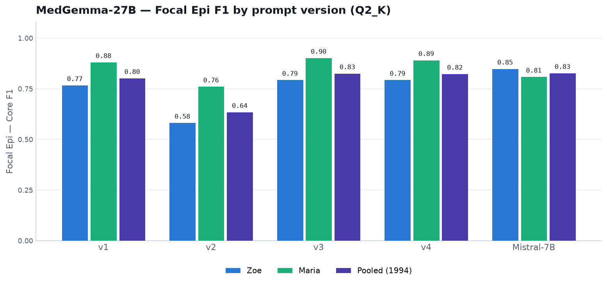

**What you see:** Focal Epi F1 by prompt, per dataset and pooled, with Mistral-7B for
reference. v3/v4 reach Mistral's pooled level (0.83), and on **Maria they beat it**
(0.90 / 0.89 vs 0.81). v2 is far below.

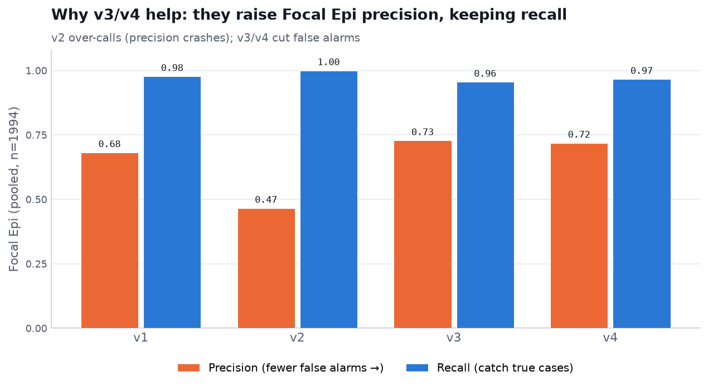

**What you see (why it works):** Focal Epi is precision-limited — the model catches
almost every true case (recall ~0.97) but over-calls. v3/v4 raise **precision**
(0.68 → 0.73) by cutting false alarms while keeping recall; **v2 does the opposite**
(precision 0.47). Making the model *more conservative* about focal epileptiform is
the correct fix, which is the reverse of what v2 encouraged.

---

## Numbers (Q2_K, pooled Core F1 vs LD)

| Prompt | Abnorm | Focal Epi | Gen Epi | Focal Non | Gen Non | fully-correct |
|---|---|---|---|---|---|---|
| v1 | 0.97 | 0.80 | 0.89 | 0.88 | 0.84 | 1672 |
| v2 | 0.98 | 0.64 | 0.88 | 0.86 | 0.82 | 1576 |
| **v3** | 0.96 | **0.83** | 0.87 | 0.87 | 0.86 | **1679** |
| v4 | 0.96 | 0.82 | 0.87 | 0.87 | 0.87 | 1662 |
| *Mistral-7B* | *0.95* | *0.83* | *0.75* | *0.76* | *0.75* | *1485* |

Q2_K beats Q4_K_S for every prompt, so **v3 + Q2_K is the recommended configuration**.

> **Note on the charts above:** all the variant comparisons use the **Q2_K**
> quantization (the recommended one). The quantization comparison is below.

## 4. Quantization — Q2_K vs Q4_K_S, per prompt

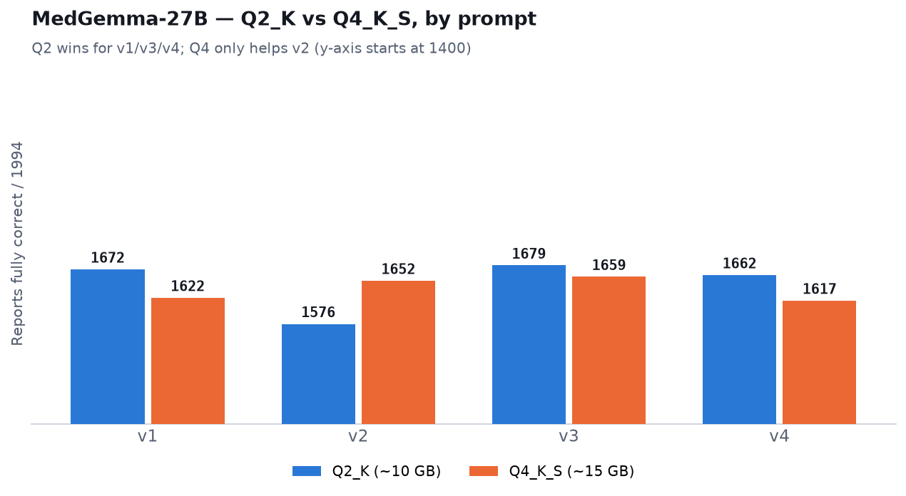

**What you see:** on whole-report accuracy the smaller **Q2_K is ahead for v1, v3, and
v4**; the larger Q4_K_S is only ahead for v2. Since Q4_K_S is ~50% bigger with no
whole-report gain on the stronger prompts, we use **Q2_K as the default**. This is also
why the cross-model comparison (vs Mistral, vs human) is done at **v1 + Q2_K**: v1 is
the plain baseline prompt, and there Q2_K is higher on Zoe and level on Maria, at half
the size — the larger quant buys nothing on the clean prompt.

Broken down by category:

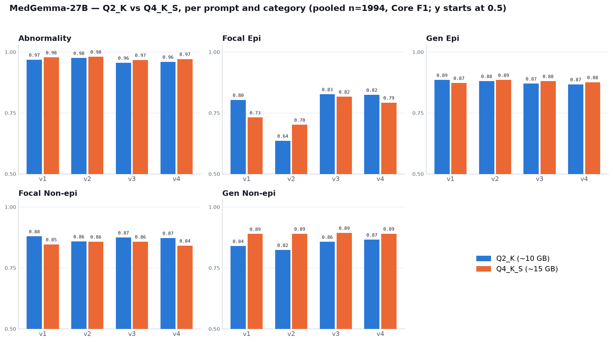

**What you see:** the quantization effect is category-dependent and small. Per category
the two are close, with **Q4_K_S a little higher on 3 of 5** (averaged over the four
prompts):

| Category | Q2_K | Q4_K_S | Δ (Q4−Q2) |
|---|---|---|---|
| Abnormality | 0.965 | 0.975 | +0.010 |
| Focal Epi | 0.773 | 0.761 | −0.012 |
| Gen Epi | 0.876 | 0.879 | +0.003 |
| Focal Non-epi | 0.871 | 0.851 | −0.020 |
| Gen Non-epi | 0.847 | 0.891 | **+0.044** |

So per category Q4 often looks a touch higher. But **whole-report** accuracy (all 5
labels right) leans the other way:

| Prompt | Q2_K fully-correct | Q4_K_S fully-correct |
|---|---|---|
| v1 | **1672** | 1622 |
| v2 | 1576 | **1652** |
| v3 | **1679** | 1659 |
| v4 | **1662** | 1617 |

**Why the two views disagree:** Q2_K is higher on **Focal Non-epi**, a *common* class
(~27% of reports), so its −0.02 under Q4 breaks many whole reports; Q4's larger
Gen Non-epi edge often doesn't flip a report to fully-correct because it still fails
another label. The gaps are small either way — we default to Q2_K for whole-report
accuracy and half the size, while Q4_K_S is a little stronger if one specific class
like Gen Non-epi matters most.

<details>
<summary><b>Where the prompts live</b></summary>

All four are in [core/prompt.py](core/prompt.py): `PROMPT_PREFIX` (v1),
`PROMPT_PREFIX_V2/V3/V4`, and `SYSTEM_V1/V2`; selected by the `PROMPT_VARIANT`
env var. Print any one, e.g.:
`python -c "import core.prompt as p; print(p.PROMPT_PREFIX_V3)"`.

</details>

## Core vs exact-level confidence — one chart per algorithm

Same view as the baseline dumbbell, now for every configuration. Each line runs
from **Core F1** (● right — did we get present/absent right, 1-2 vs 3-4) to
**Certainty F1** (○ left — did we get the *exact* level 1/2/3/4). **Line length =
how much is lost** when the exact confidence level is required. All pooled over 1994
reports.

The headline contrast is **Focal Epi**: our v3 keeps a short line (0.83 → 0.69),
while Mistral's collapses (0.83 → **0.41**) — it calls focal epileptiform in the
right direction but badly misses the confidence level. The one place Mistral's line
is shorter than ours is **Abnormality** (its certainty 0.72 vs our 0.60).

**Q2_K** (the recommended quantization):

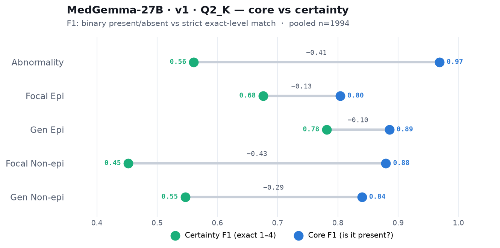
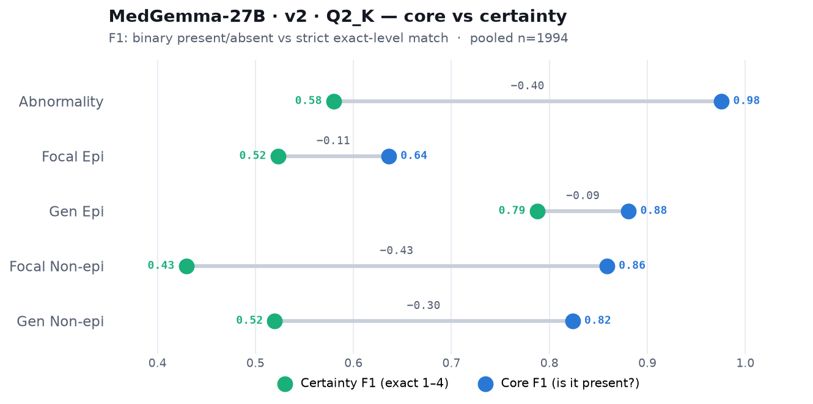
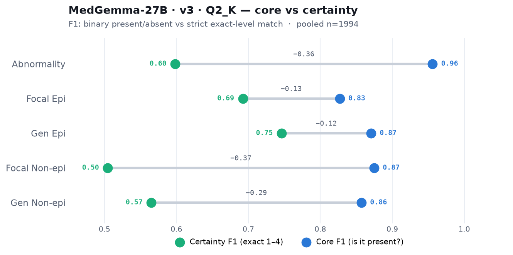
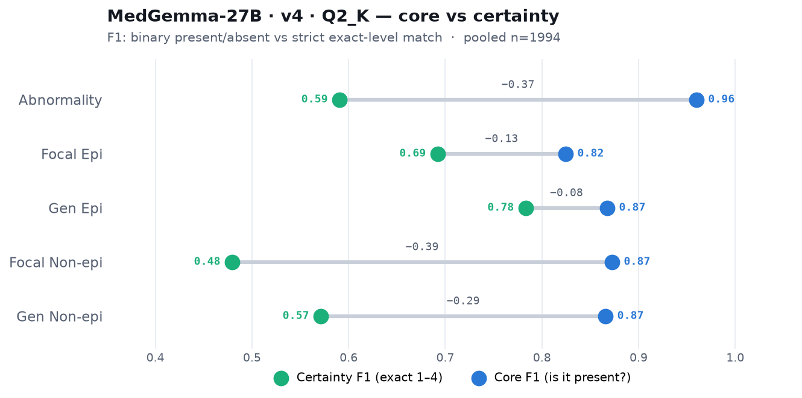


**Q4_K_S:**

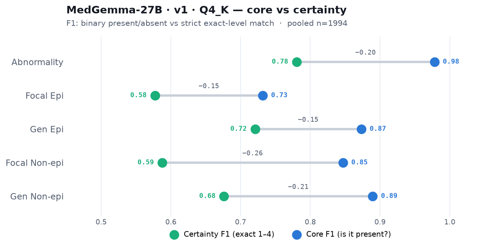
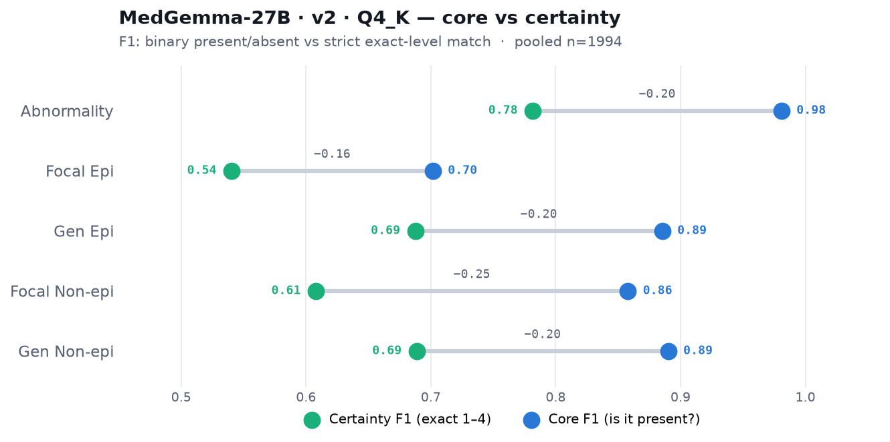
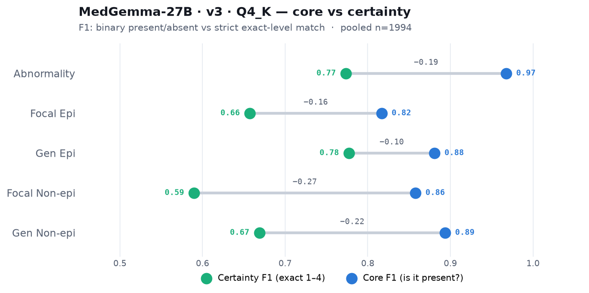
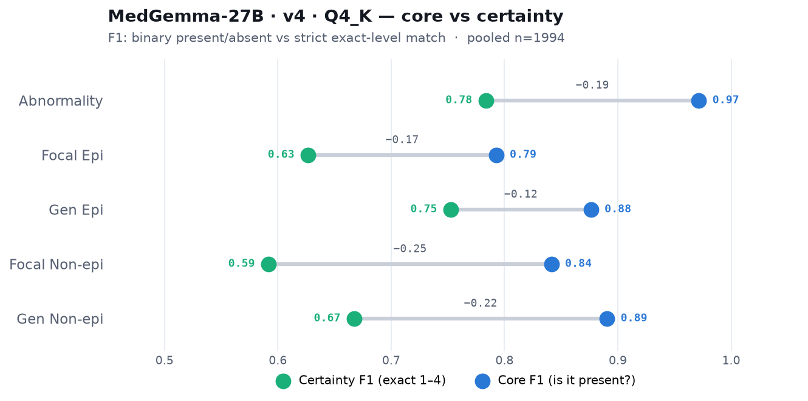

## All numbers — every run, both datasets

Complete Core F1 (vs LD) per category plus fully-correct counts, for all 8 MedGemma
runs (4 prompts × 2 quants), the paper's **Mistral-7B**, and the **human** second
annotator (SG). Generated by [analysis/make_tables.py](analysis/make_tables.py) from
`results/*.json`, the released Mistral prediction DB, and the `sg_labels` stored in our
JSONs — nothing is hand-typed.

### Pooled — Zoe + Maria  (n=1994)

| Model | Prompt | Quant | Abnormality | Focal Epi | Gen Epi | Focal Non-epi | Gen Non-epi | Fully-correct |
|---|---|---|---|---|---|---|---|---|
| MedGemma-27B | v1 | Q2_K | 0.97 | 0.80 | 0.89 | 0.88 | 0.84 | 1672 |
| MedGemma-27B | v1 | Q4_K_S | 0.98 | 0.73 | 0.87 | 0.85 | 0.89 | 1622 |
| MedGemma-27B | v2 | Q2_K | 0.98 | 0.64 | 0.88 | 0.86 | 0.82 | 1576 |
| MedGemma-27B | v2 | Q4_K_S | 0.98 | 0.70 | 0.89 | 0.86 | 0.89 | 1652 |
| MedGemma-27B | v3 | Q2_K | 0.96 | 0.83 | 0.87 | 0.87 | 0.86 | 1679 |
| MedGemma-27B | v3 | Q4_K_S | 0.97 | 0.82 | 0.88 | 0.86 | 0.89 | 1659 |
| MedGemma-27B | v4 | Q2_K | 0.96 | 0.82 | 0.87 | 0.87 | 0.87 | 1662 |
| MedGemma-27B | v4 | Q4_K_S | 0.97 | 0.79 | 0.88 | 0.84 | 0.89 | 1617 |
| *Mistral-7B (paper)* | — | — | *0.95* | *0.83* | *0.75* | *0.76* | *0.75* | *1485* |
| *Human (SG, 2nd annotator)* | — | — | *0.98* | *0.86* | *0.88* | *0.91* | *0.90* | *1791* |

### Zoe — in-distribution  (n=1495)

| Model | Prompt | Quant | Abnormality | Focal Epi | Gen Epi | Focal Non-epi | Gen Non-epi | Fully-correct |
|---|---|---|---|---|---|---|---|---|
| MedGemma-27B | v1 | Q2_K | 0.98 | 0.77 | 0.90 | 0.87 | 0.85 | 1255 |
| MedGemma-27B | v1 | Q4_K_S | 0.98 | 0.66 | 0.88 | 0.83 | 0.90 | 1205 |
| MedGemma-27B | v2 | Q2_K | 0.98 | 0.58 | 0.89 | 0.84 | 0.84 | 1159 |
| MedGemma-27B | v2 | Q4_K_S | 0.98 | 0.64 | 0.89 | 0.84 | 0.90 | 1215 |
| MedGemma-27B | v3 | Q2_K | 0.97 | 0.79 | 0.87 | 0.88 | 0.88 | 1272 |
| MedGemma-27B | v3 | Q4_K_S | 0.98 | 0.78 | 0.89 | 0.84 | 0.91 | 1240 |
| MedGemma-27B | v4 | Q2_K | 0.97 | 0.79 | 0.87 | 0.87 | 0.89 | 1253 |
| MedGemma-27B | v4 | Q4_K_S | 0.98 | 0.75 | 0.89 | 0.82 | 0.90 | 1201 |
| *Mistral-7B (paper)* | — | — | *0.96* | *0.84* | *0.73* | *0.76* | *0.79* | *1126* |
| *Human (SG, 2nd annotator)* | — | — | *0.98* | *0.84* | *0.89* | *0.90* | *0.90* | *1328* |

### Maria — out-of-distribution  (n=499)

| Model | Prompt | Quant | Abnormality | Focal Epi | Gen Epi | Focal Non-epi | Gen Non-epi | Fully-correct |
|---|---|---|---|---|---|---|---|---|
| MedGemma-27B | v1 | Q2_K | 0.92 | 0.88 | 0.84 | 0.91 | 0.75 | 417 |
| MedGemma-27B | v1 | Q4_K_S | 0.95 | 0.90 | 0.84 | 0.89 | 0.83 | 417 |
| MedGemma-27B | v2 | Q2_K | 0.97 | 0.76 | 0.84 | 0.91 | 0.76 | 417 |
| MedGemma-27B | v2 | Q4_K_S | 0.97 | 0.88 | 0.86 | 0.91 | 0.84 | 437 |
| MedGemma-27B | v3 | Q2_K | 0.91 | 0.90 | 0.86 | 0.87 | 0.73 | 407 |
| MedGemma-27B | v3 | Q4_K_S | 0.93 | 0.91 | 0.84 | 0.90 | 0.82 | 419 |
| MedGemma-27B | v4 | Q2_K | 0.92 | 0.89 | 0.86 | 0.89 | 0.74 | 409 |
| MedGemma-27B | v4 | Q4_K_S | 0.94 | 0.91 | 0.84 | 0.90 | 0.84 | 416 |
| *Mistral-7B (paper)* | — | — | *0.90* | *0.81* | *0.84* | *0.74* | *0.54* | *359* |
| *Human (SG, 2nd annotator)* | — | — | *0.98* | *0.90* | *0.84* | *0.94* | *0.90* | *463* |

Mistral's per-dataset F1 reproduces the paper's Table III; the human row is the
annotator ceiling (SG vs LD).

## Reproduce

```bash
source .venv/bin/activate
python -m analysis.make_tables         # the numbers tables above
python -m analysis.plot_v34            # variant-comparison charts
python -m analysis.plot_dumbbells      # per-algorithm core-vs-certainty dumbbells

# a run — prompt / dataset / quant are env-selected:
DATASET=zoe GGUF_QUANT=Q2_K PROMPT_VARIANT=v3 CTX_SIZE=8192 \
  sbatch cpu/run_benchmark.sbatch 0 1495 results/zoe_v3_cpu_q2_k_full_n1495.json
```

The baseline analysis (v1/v2 detail, generalization, calibration, over/under-calling,
pooled vs-Mistral and vs-human charts) is in [results_baseline.md](results_baseline.md).
Model: MedGemma-27B GGUF, llama.cpp grammar-constrained, temp 0, 64-core CPU.
