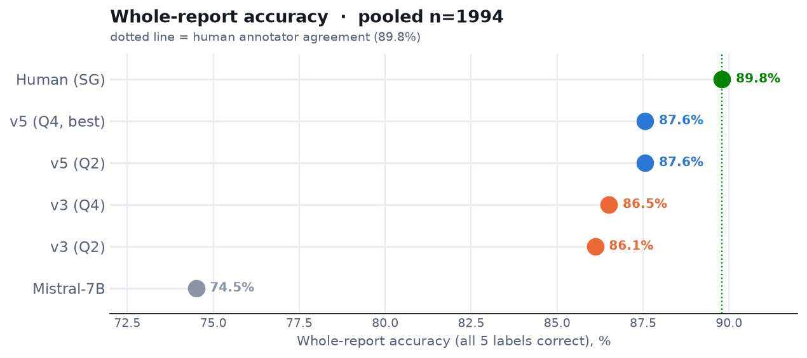

# EEG report classification with MedGemma-27B — summary

Turning free-text clinical EEG reports into five structured diagnostic labels (overall
abnormality; focal / generalized epileptiform; focal / generalized non-epileptiform) with a
small, CPU-run, grammar-constrained **MedGemma-27B**. Benchmarked against the paper's
**Mistral-7B** (Tian et al.) and a **human** second annotator (SG), on 1994 reports
(two neurologists, "Zoe" + "Maria"), scored against reference annotator LD.

> **Key result:** our best prompt, **v5**, reaches **87.6%** whole-report accuracy — it
> **beats Mistral-7B on all five categories** and comes within ~2 points of the human
> annotator (89.8%).

## Where each version lands

Two prompt generations, at both model sizes (Q2 ≈ 10 GB, Q4 ≈ 15 GB): **v3** adds an
explicit rule for the rare *focal epileptiform* class; **v5** adds a *focal-vs-generalized*
rule for slowing. Each step climbs toward the human line; **v5 (Q4)** is the best.

## Per category

**Each model is a dumbbell:** filled dot = **Core F1** (present/absent — number on the
right), open dot = **Certainty F1** (exact 1–4 level — number on the left); the line is the
drop. On **Core**, our v5 beats Mistral (grey) in every category — by 10–15 points on the
harder three — and lands at the human level on the epileptiform categories. On
**Certainty**, Mistral's open circles collapse (Focal Epi 41) while ours hold.

**Zoe (in-distribution, n=1495):**

**Maria (out-of-distribution, n=499):**

## Numbers (pooled n = 1994, Core F1 vs LD)

| Model | Abnorm | Focal Epi | Gen Epi | Focal Non | Gen Non | Whole report |
|---|---|---|---|---|---|---|
| Mistral-7B | 94.7 | 82.8 | 74.8 | 75.6 | 75.2 | 74.5 |
| v3 (Q2) | 95.2 | 88.5 | 90.4 | 88.2 | 85.3 | 86.1 |
| v3 (Q4) | 95.9 | 86.4 | 89.2 | 86.9 | 89.6 | 86.5 |
| v5 (Q2) | 95.4 | 87.6 | 89.9 | 88.8 | 86.7 | 87.6 |
| **v5 (Q4, best)** | 96.0 | 85.6 | 88.8 | 89.0 | 89.3 | **87.6** |
| *Human (SG)* | 98.0 | 85.7 | 87.5 | 90.8 | 90.0 | 89.8 |

*Per-category values are F1 (0–100), which measures how well each finding is caught — the
standard metric for these imbalanced classes. "Whole report" is the share of reports with
all five labels correct.*

**By dataset — Zoe (in-distribution, n = 1495):**

| Model | Abnorm | Focal Epi | Gen Epi | Focal Non | Gen Non | Whole report |
|---|---|---|---|---|---|---|
| Mistral-7B | 96.1 | 84.0 | 72.5 | 76.0 | 79.0 | 75.3 |
| v3 (Q2) | 95.9 | 87.8 | 91.8 | 87.9 | 87.7 | 86.3 |
| v3 (Q4) | 96.4 | 85.3 | 90.8 | 85.5 | 91.0 | 86.1 |
| v5 (Q2) | 96.1 | 87.1 | 91.2 | 89.0 | 87.9 | 87.8 |
| **v5 (Q4)** | 96.3 | 84.1 | 90.2 | 88.1 | 90.6 | 87.2 |
| Human (SG) | 97.9 | 83.7 | 88.7 | 89.5 | 89.9 | 88.8 |

**By dataset — Maria (out-of-distribution, n = 499):**

| Model | Abnorm | Focal Epi | Gen Epi | Focal Non | Gen Non | Whole report |
|---|---|---|---|---|---|---|
| Mistral-7B | 89.8 | 80.6 | 83.7 | 74.5 | 54.0 | 71.9 |
| v3 (Q2) | 92.6 | 90.0 | 85.7 | 89.0 | 72.1 | 85.6 |
| v3 (Q4) | 94.5 | 88.9 | 83.7 | 90.8 | 81.6 | 87.8 |
| v5 (Q2) | 93.2 | 88.5 | 85.7 | 88.1 | 80.0 | 86.8 |
| **v5 (Q4)** | 95.0 | 88.9 | 83.7 | 91.3 | 82.2 | 88.8 |
| Human (SG) | 98.1 | 90.0 | 83.7 | 94.4 | 90.4 | 92.8 |

## Confidence — Certainty (exact-level) F1

The **Certainty** metric is stricter: the model must also get the exact 1–4 confidence level
right. This is where our approach separates most from Mistral — on the per-category chart
above it is the **open circle** (the drop from the filled Core dot). The **Whole** column =
share of reports with all five *exact* levels correct.

**Pooled (n = 1994):**

| Model | Abnorm | Focal Epi | Gen Epi | Focal Non | Gen Non | Whole |
|---|---|---|---|---|---|---|
| Mistral-7B | 72.4 | 41.4 | 69.2 | 44.8 | 52.2 | 40.7 |
| v3 (Q2) | 70.0 | 75.4 | 83.0 | 67.6 | 65.0 | 68.1 |
| v3 (Q4) | 75.6 | 66.3 | 75.9 | 60.6 | 67.1 | 66.8 |
| v5 (Q2) | 65.8 | 76.8 | 83.6 | 59.3 | 60.1 | 66.5 |
| **v5 (Q4)** | 74.1 | 66.7 | 72.4 | 63.1 | 69.0 | 67.9 |
| Human (SG) | 92.0 | 72.0 | 84.1 | 46.9 | 58.3 | 65.9 |

**Zoe (n = 1495):**

| Model | Abnorm | Focal Epi | Gen Epi | Focal Non | Gen Non | Whole |
|---|---|---|---|---|---|---|
| Mistral-7B | 72.5 | 42.7 | 65.5 | 41.4 | 55.0 | 40.4 |
| v3 (Q2) | 67.7 | 69.9 | 82.2 | 66.7 | 67.1 | 65.6 |
| v3 (Q4) | 77.3 | 64.7 | 73.7 | 64.3 | 71.8 | 66.0 |
| v5 (Q2) | 61.9 | 72.6 | 83.0 | 53.7 | 60.8 | 62.9 |
| **v5 (Q4)** | 74.7 | 63.8 | 70.6 | 65.8 | 72.2 | 66.4 |
| Human (SG) | 91.5 | 69.8 | 84.2 | 42.5 | 58.9 | 63.5 |

**Maria (n = 499):**

| Model | Abnorm | Focal Epi | Gen Epi | Focal Non | Gen Non | Whole |
|---|---|---|---|---|---|---|
| Mistral-7B | 72.2 | 38.8 | 83.7 | 55.5 | 36.5 | 41.5 |
| v3 (Q2) | 77.9 | 86.7 | 85.7 | 70.2 | 52.9 | 75.6 |
| v3 (Q4) | 69.6 | 69.8 | 83.7 | 50.0 | 40.8 | 69.1 |
| v5 (Q2) | 79.2 | 85.2 | 85.7 | 75.1 | 56.3 | 77.4 |
| **v5 (Q4)** | 72.3 | 73.0 | 79.1 | 55.3 | 50.7 | 72.5 |
| Human (SG) | 93.5 | 76.7 | 83.7 | 59.1 | 54.8 | 73.3 |

On focal epileptiform, Mistral drops to ~40 while v3/v5 hold ~65–86. Even the human's
certainty on the slowing classes is modest — those are genuinely hard to pin to an exact
level.

## Key points

- **Beats the external baseline everywhere.** v5 is above Mistral-7B in all five categories,
  decisively on the harder ones (e.g. Gen Epi 89 vs 75, Focal Non-epi 89 vs 76).
- **Near-human.** 87.6% vs the 89.8% human ceiling; on the epileptiform classes it already
  matches the human.
- **Captures confidence, not just the finding.** When the *exact* confidence level must
  match, Mistral collapses on focal epileptiform (F1 0.41) while v5 holds (0.67–0.77).
- **Generalizes.** The result holds on an unseen neurologist (Maria) and against a
  held-out second annotator — so it reflects real clinical reasoning, not fitting to one
  reader's phrasing.
- **Practical.** Runs on CPU; the smaller Q2 model is enough (same whole-report accuracy as
  Q4, at ~⅔ the size).

---

*v3 and v5 here are run with a consistency-guaranteeing decoding constraint (a grammar that
forbids self-contradictory outputs). Full technical detail, all 10 prompt variants, the
tested-and-rejected ideas, and per-dataset tables:*
[all_prompts.md](all_prompts.md) *· prompt texts:* [`../prompts/`](../prompts/).
