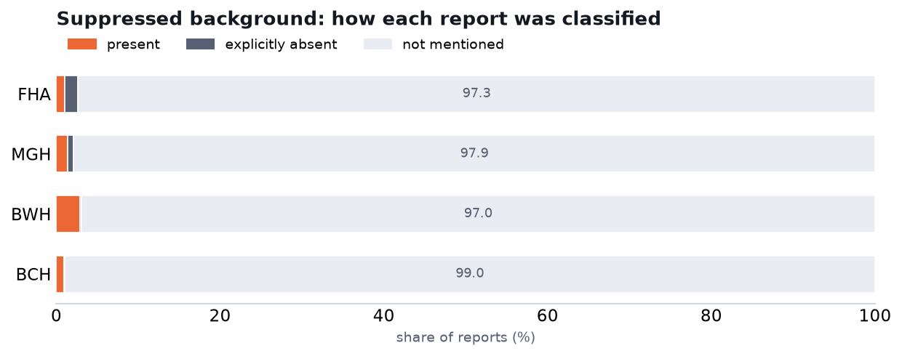

# Suppressed background — labeling clinical EEG reports

We labeled every report for whether it explicitly calls the EEG background **suppressed** —
i.e. generalized or diffuse suppression of the background activity. Three-way call: the report says
so (`present`), the report says suppression is absent (`explicitly_absent`), or it isn't mentioned
(`not_mentioned`). Vasily's suggested prompt, used verbatim, grammar-constrained so the answer is
exactly one of those three. MedGemma-27B (Q4_K_S), temperature 0.

The prompt deliberately keeps this separate from burst-suppression: a report that describes
burst-suppression, suppression-burst, burst-attenuation, or brief event-related suppression is
**not** counted as a suppressed background unless it also explicitly says the overall background is
suppressed.

It ran on Fraser Health (45,545 reports) and three Harvard hospitals — MGH, BWH, BCH (~100,600;
BIDMC has no report text). About 1.3% of Harvard reports are longer than the context window and
returned nothing; they are excluded.

## Is there a matching Harvard variable?

No. Harvard's `bs` column is *burst*-suppression, a different pattern; `low voltage` is amplitude,
also different. There is no column for a plainly suppressed background, so this field is our labels
only, with no head-to-head against Harvard. How Harvard codes the columns it does have is in the
companion note `reports/harvard_llm_labeling.md`.

## What we found



| dataset | present | explicitly absent | not mentioned | reports |
|---|---|---|---|---|
| Fraser Health | 1.0% | 1.7% | 97.4% | 45,545 |
| MGH | 1.4% | 0.7% | 97.9% | 54,823 |
| BWH | 2.9% | 0.1% | 97.0% | 20,691 |
| BCH | 0.9% | 0.1% | 99.0% | 25,022 |

Suppressed background behaves like an ordinary rare finding, and it behaves the same way across
both cohorts: present in roughly 1–3% of reports, almost never explicitly called absent, and
otherwise not mentioned. Unlike discontinuous background (where the Harvard reports comment on
continuity far more than Fraser Health's do), here there's no cohort quirk — the reporting style is
consistent, and the present rates line up. BWH is slightly higher (2.9%), in line with its
generally higher critical-care rates — it also tops the triphasic and burst-suppression counts.

## Caveats

- No Harvard column to check against, so this is our own labeling with no external reference.
- Kept strictly separate from burst-suppression per the prompt — a report is only counted here if
  it calls the *overall background* suppressed, not because suppression occurs inside another
  pattern.
- About 1.3% of Harvard reports were too long for the context window and returned no label; they
  are excluded.

## Reproduce

```bash
# labeling (on the cluster)
bash slurm/submit_background.sh            # Fraser Health, all background fields
bash slurm/submit_background_harvard.sh    # MGH / BWH / BCH
# distribution + chart
python -m analysis.background_dist                 # results/background/dist_summary.json
python -m analysis.background_field_charts         # figures/dist_suppressed.png
```

Labeler and prompt: `src/cpu/background.py` (field `suppressed`). Companion note on the Harvard
fields: `reports/harvard_llm_labeling.md`.
