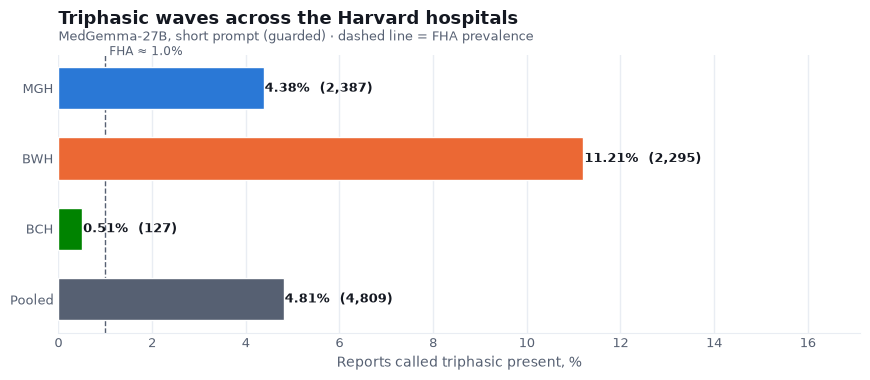
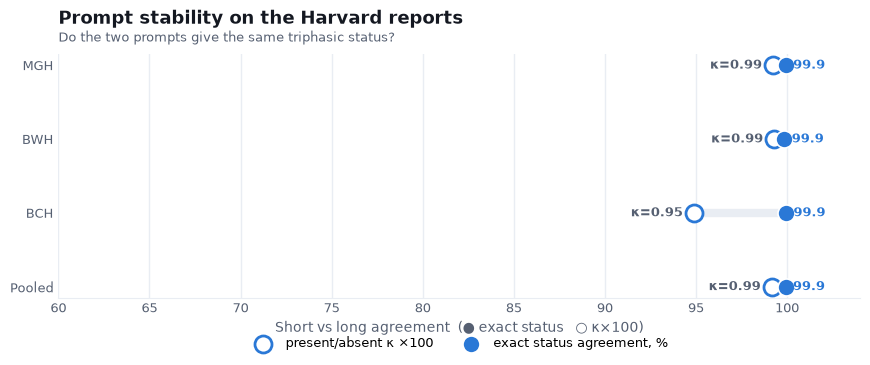

# Triphasic waves in the Harvard EEG reports — MedGemma-27B annotation

We ran the same triphasic-wave annotation we built for the Fraser Health reports over the three
Harvard hospitals — MGH, BWH, and BCH, about 101,600 reports — with MedGemma-27B (Q4,
grammar-constrained, temperature 0). Each report gets a status (present, explicitly absent, or
not mentioned) and, when present, a phenotype (typical, atypical, mixed, or unspecified). As on
the FHA set we ran it twice, with a short prompt and a longer one, to check the result does not
depend on the wording, and we apply the same guard: a present or absent call has to have the
triphasic term in the report text, otherwise it becomes not mentioned.

About 98–99% of reports got a valid annotation in both prompts; the ~1–2% gap at MGH and BWH is
almost all very long continuous-monitoring reports that run past the model's context window (BCH
had none). The numbers below are the guarded short-prompt labels.

## How often triphasic waves appear



| Hospital | Reports | Present | Present % | Explicitly absent | Not mentioned |
|---|---|---|---|---|---|
| MGH | 54,452 | 2,387 | 4.38% | 26 | 52,430 |
| BWH | 20,474 | 2,295 | 11.21% | 29 | 18,372 |
| BCH | 25,022 | 127 | 0.51% | 7 | 24,888 |
| **Pooled** | **99,948** | **4,809** | **4.81%** | **62** | **95,690** |

The rate varies a lot by hospital, and it is much higher than the ~1% we saw at Fraser Health.
BWH stands out at 11%, MGH at about 4%, while the pediatric hospital BCH is only 0.5%. This
tracks the patients: triphasic waves are a marker of metabolic and anoxic encephalopathy, common
in the critical-care and inpatient populations of large adult academic centers and rare in
children. So the difference is about who is being recorded, not about the model behaving
differently — the reports at BWH and MGH simply describe triphasic waves far more often.

## What kind of triphasic waves

Pooled across the three hospitals, of the reports called present the phenotype is **unspecified
4,115, typical 404, atypical 256, mixed 34**. As on the FHA set, most reports that mention
triphasic waves do not describe enough morphology to sub-type them, so the great majority land in
unspecified.

## Do the two prompts agree



| Hospital | Exact status agreement | present/absent κ |
|---|---|---|
| MGH | 99.93% | 0.99 |
| BWH | 99.85% | 0.99 |
| BCH | 99.95% | 0.95 |
| **Pooled** | **99.92%** | **0.99** |

The two prompts give the same status on more than 99.8% of reports everywhere, with κ around
0.99 (0.95 at BCH, where present cases are few). This is the same result we got on the FHA set,
now on a different hospital system: the annotation barely moves with the wording of the prompt.

## Faithfulness

The guard flipped **367 reports** (MGH 267, BWH 91, BCH 9) from present or absent to not
mentioned — cases where the model inferred triphasic waves from an anoxic or metabolic context
with no triphasic wording in the text. That is the same error mode we saw on the FHA reports, and
the same one-line text check removes it; after the guard every present or absent label has the
term in the report.

## In short

Triphasic waves are documented in about 5% of the Harvard reports pooled, but that hides a wide
spread — 11% at BWH, 4% at MGH, 0.5% at the pediatric hospital — driven by the patient
population, not the model. The annotation is stable to the prompt (99.9% agreement, κ = 0.99),
the same as on Fraser Health, and the one recurring error, reading triphasic waves into an
anoxic or metabolic picture, is small and filtered out. There is no human ground truth here, so
these are the model's reading of the reports.

## Reproduce

```bash
python -m analysis.triphasic_harvard_analysis     # the tables above and the two figures
```

Labels are produced by `slurm/submit_triphasic_harvard.sh` (via `slurm/label_triphasic.sbatch`),
which runs `src/cpu/triphasic.py` reading the report text from the HEEDB zips through the cohort
indexes. Output: `results/triphasic_harvard/<COHORT>/<VARIANT>/`.

---

*Pipeline, prompts, grammar, and the scripts behind this report:*
**https://github.com/vbronetskyi/eeg-report-classification**
