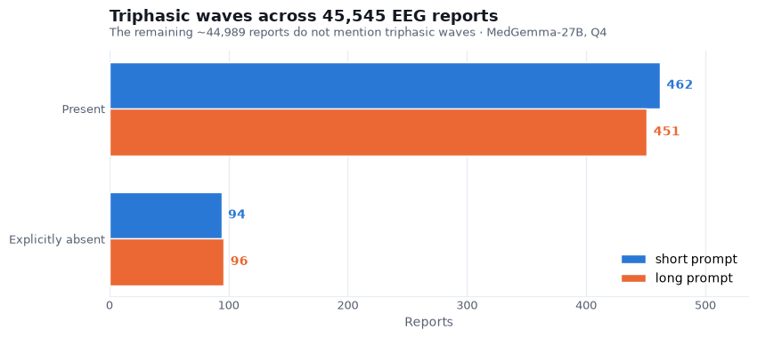
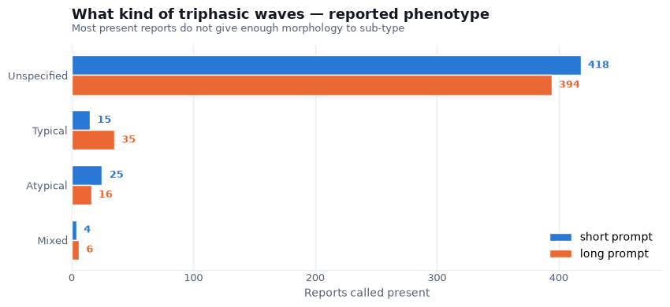
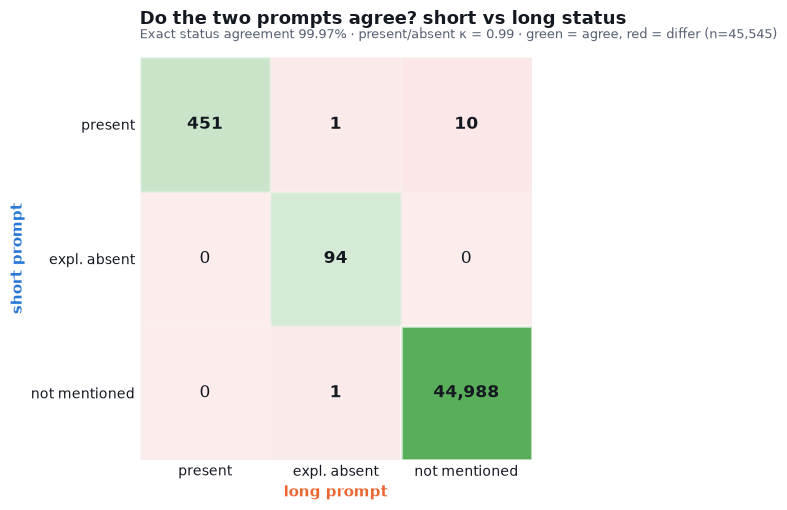

# Triphasic waves in the FHA EEG reports — MedGemma-27B annotation

We ran MedGemma-27B over all 45,545 Fraser Health EEG reports and marked, for each one, what
the neurologist wrote about triphasic waves. There are two things per report: the status
(present, explicitly absent, or not mentioned) and, when present, the phenotype (typical,
atypical, mixed, or unspecified when the report does not say). This is reading the report, not
diagnosing the patient. The model is told to go by the text and not to guess triphasic waves
from a diagnosis, from encephalopathy, or from periodic discharges. A grammar constrains the
output, so all 45,545 reports came back in a valid form with no parsing errors.

We ran the whole set twice, once with a short prompt and once with a longer one carrying the
PI's full definitions, to see whether the wording changes the answer.

## How often triphasic waves appear



Triphasic waves hardly show up. Around one report in a hundred says they are present (462 with
the short prompt, 451 with the long), and about ninety more say outright that they are not.
Everything else, close to 99%, never brings them up. The two prompts land in almost the same
place.

## What kind of triphasic waves



When a report does mention triphasic waves, it usually does not describe them in enough detail
to say what kind, so most fall under unspecified (418 short, 394 long). The two prompts agree on
how many are present but divide the small remainder a little differently: the long prompt labels
a few more typical (35 vs 15), the short one a few more atypical (25 vs 16). Those are the
borderline reports with only a partial description, where the extra wording in the long prompt
nudges a handful toward typical.

## Do the two prompts agree



The grid reads like this: each report falls into one cell by what the short prompt called it
(the row) and what the long prompt called it (the column), and the green diagonal is where the
two agree. Almost everything sits on the diagonal. Out of 45,545 reports the two prompts give
the same status all but 12 times, so 99.97%, with κ = 0.99. Since nearly every report is a
shared not-mentioned, the fairer number is on the reports at least one prompt flagged: of those
557, the two agree 97.8% of the time. The twelve disagreements are all right at the edge, mostly
a hedged mention that the short prompt counts as present and the long prompt lets go. The
wording of the prompt barely moves the result.

## Faithfulness to the text

We also checked the present and absent calls against the actual text. A few reports had the
model say triphasic waves were present when the word never appears anywhere in the report: five
with the short prompt, eleven with the long. Every one was an anoxic, cardiac-arrest, or
metabolic case, the kind of patient where triphasic waves are expected, so the model was filling
in from context instead of reading the report. That is the one thing the prompt tells it not to
do. To catch it we require the word itself (triphasic, tri-phasic, or 3-phasic) to be in the
report before a present or absent call stands; when it is not, the call becomes not mentioned.
That only drops claims the text does not back up, and never adds one. After it, every present or
absent label has the word in the report, and that is what the numbers above use.

The opposite case, where the word is in the text but the model said not mentioned (12 short, 21
long), is the model being careful in the right way. Those are clinical questions like query
triphasic waves or rule out triphasic waves, hedged lines like suggested but not definite or
almost a triphasic appearance but not sustained, and passing general remarks, none of which is
the neurologist actually reporting the finding.

## In short

Triphasic waves are documented in about 1% of these reports and absent from the rest. The
annotation holds up whichever prompt we use (99.97% agreement, κ = 0.99), and the one recurring
mistake, reading triphasic waves into an anoxic or metabolic picture, is small and easy to
filter out. There is no human-labelled truth for these reports, so the 1% is the model's reading
rather than a verified rate.

## Reproduce

```bash
python -m analysis.triphasic_analysis     # guard + the three figures + all numbers
```

Labels are produced by `slurm/label_triphasic.sbatch` (via `slurm/submit_triphasic.sh`), which
runs `src/cpu/triphasic.py`, where the two prompts and the grammar live. Raw per-chunk output is
in `results/triphasic/{short,long}/`; the guarded labels are in
`results/triphasic/clean/{short,long}.json`.

---

*Pipeline, prompts, grammar, and the scripts behind this report:*
**https://github.com/vbronetskyi/eeg-report-classification**
